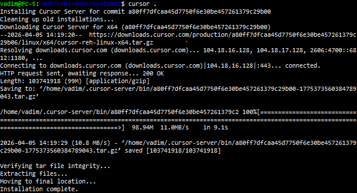
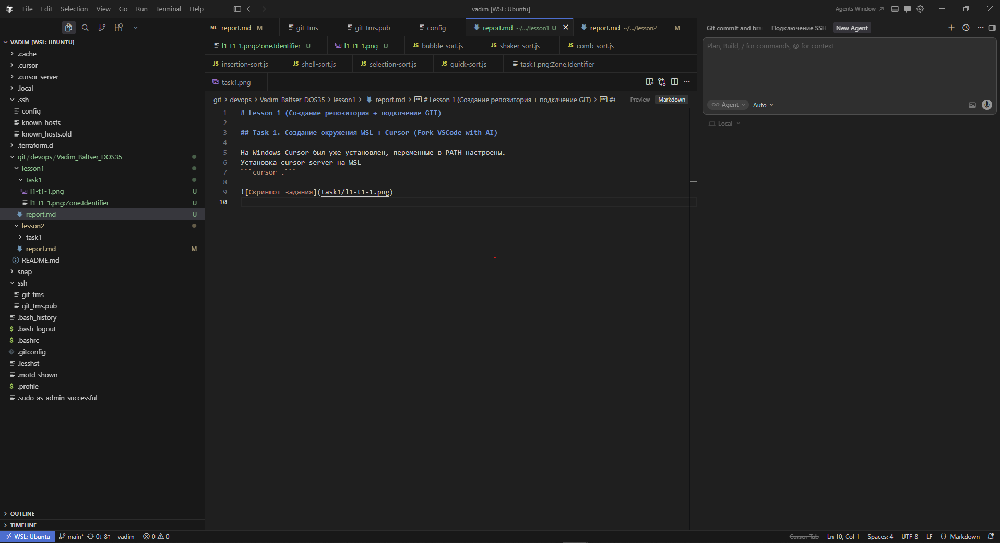

# Lesson 1 (Создание окружения WSL + создание репозитория)

## Создание окружения WSL + Cursor (Fork VSCode with AI)

На Windows Cursor был уже установлен, переменные в PATH настроены.
Установка cursor-server на WSL
```cursor .```



Запущенный Cursor из WSL
```cd ~/```
```cursor .```


