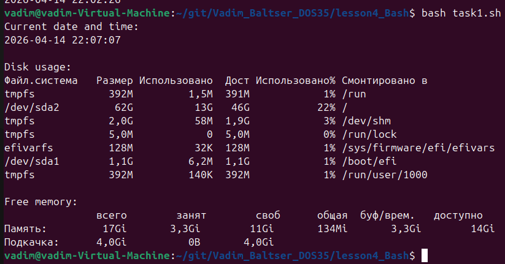
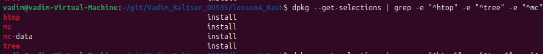
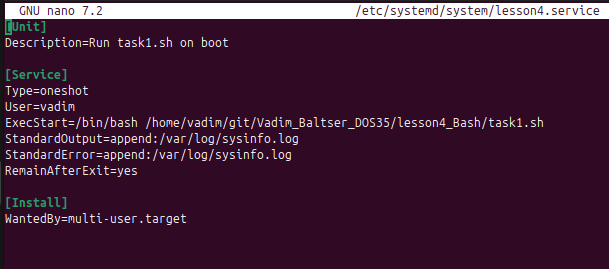
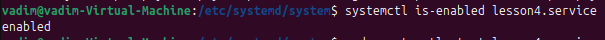
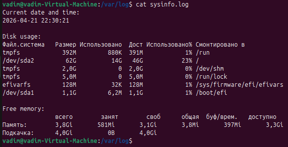
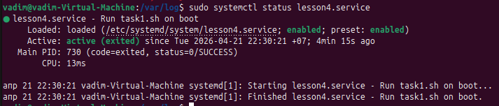

# Lesson 4. Bash

## Task 1. Первый bash-скрипт

Создал файл task1.sh скриптом. 

```
#!/usr/bin/env bash

echo "Current date and time:"
date "+%Y-%m-%d %H:%M:%S"
echo

echo "Disk usage:"
df -h
echo

echo "Free memory:"
free -h
```

Результат выполнения скрипта:



## Task 2-3. Установка пакетов

Установил пакеты `tree`, `mc`, `htop`



Сохранил полный список пакетов в `installed_packages.txt`

## Task 4. Создание службы

### 1) Создал файл службы c содержимым:



Блок Unit
- Description= Человеко-читаемое описание, видно в systemctl status.

Блок Service
- `Type=oneshot` Тип для коротких задач: запустилась, выполнила скрипт и завершилась.
- `User=vadim` Скрипт выполняется от пользователя vadim, а не от root. Безопаснее.
- `ExecStart=...` Команда запуска. Явно вызываем task1.sh.
- `StandardOutput=append:/var/log/sysinfo.log` Всё, что скрипт пишет через echo добавляется в лог-файл.
- `RemainAfterExit=yes` Для oneshot помечает службу как “active (exited)” после успешного выполнения.

Блок Install
- `WantedBy=multi-user.target` Привязка к обычному режиму загрузки Linux. Благодаря этому enable добавит автозапуск на старте системы.

### 2) Запуск службы:
- `sudo systemctl daemon-reload` - перезагрузка служб, т.к. закешированы.
- `sudo systemctl enable lesson4.service` - запуск службы.

проверка



### 3) Проверка запуска службы после `sudo reboot`



`sudo systemctl status lesson4.service`


