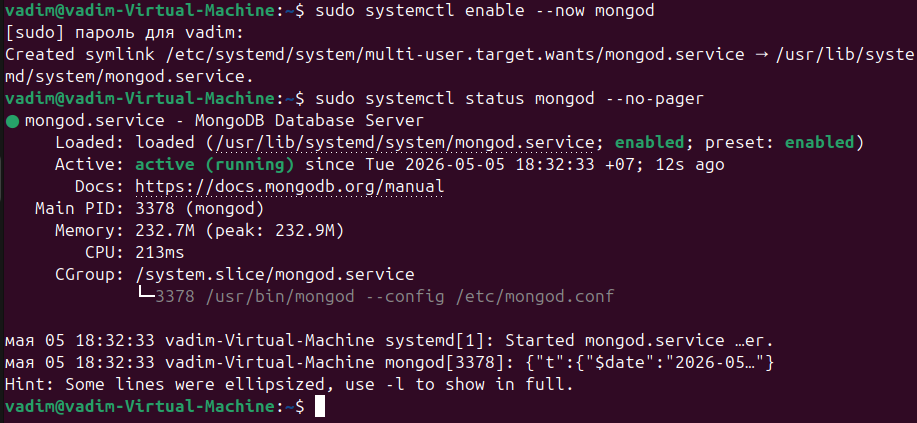
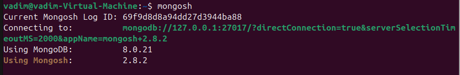
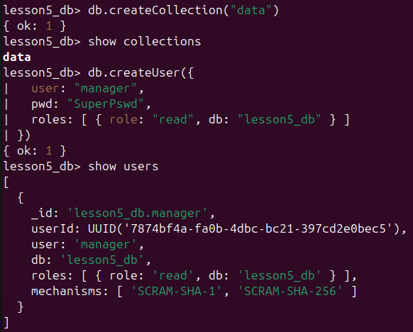

# Lesson 5. Bash-2

## Task 1. Установка MongoDB

Подключил официальный репозиторий и установил MongoDB 8.0:

```bash
curl -fsSL https://pgp.mongodb.com/server-8.0.asc | \
  sudo gpg -o /usr/share/keyrings/mongodb-server-8.0.gpg --dearmor

echo "deb [ signed-by=/usr/share/keyrings/mongodb-server-8.0.gpg ] https://repo.mongodb.org/apt/ubuntu noble/mongodb-org/8.0 multiverse" | \
  sudo tee /etc/apt/sources.list.d/mongodb-org-8.0.list

sudo apt update
sudo apt install -y mongodb-org
```

Запуск и проверка сервиса:

```bash
sudo systemctl enable --now mongod
sudo systemctl status mongod --no-pager
```



Подключение к БД:



Создание коллекции и пользователя только для чтения:

```javascript
use lesson5_db
db.createCollection("data")
db.createUser({
  user: "manager",
  pwd: "SuperPswd",
  roles: [ { role: "read", db: "lesson5_db" } ]
})
```



## Task 2. Замена расширения файла

Создал скрипт `task2.sh`, который принимает два параметра:
- исходное имя файла;
- новое расширение.

В скрипте используется параметрическое раскрытие переменных:
- `${filename%.*}` удаляет старое расширение;
- `${new_ext#.}` удаляет точку в начале нового расширения, если она есть.

Также добавлена обработка случая, когда у исходного файла нет расширения: скрипт выводит сообщение об ошибке и завершает работу с кодом `2`.

Примеры запуска:

```bash
./task2.sh report.txt md
# report.md

./task2.sh archive.tar.gz zip
# archive.tar.zip

./task2.sh README txt
# Error: source filename has no extension: README
```

## Task 3. Выделение или удаление подстроки

Создал скрипт `task3.sh`, который принимает:
- исходную строку;
- номер начального символа;
- номер конечного символа;
- необязательный режим: `extract` (по умолчанию) или `delete`.

Основное средство — команда `cut`:
- для выделения используется `cut -c start-end`;
- для удаления используется `cut --complement -c start-end`.

Также добавлены проверки:
- количество аргументов;
- корректность числового диапазона;
- корректность режима (`extract`/`delete`).

Примеры запуска:

```bash
./task3.sh "Hello_Bash_World" 7 10
# Bash

./task3.sh "Hello_Bash_World" 7 10 delete
# Hello__World

./task3.sh "Hello_Bash_World" 10 7
# Error: invalid range. Expected: 1 <= start_pos <= end_pos.
```
