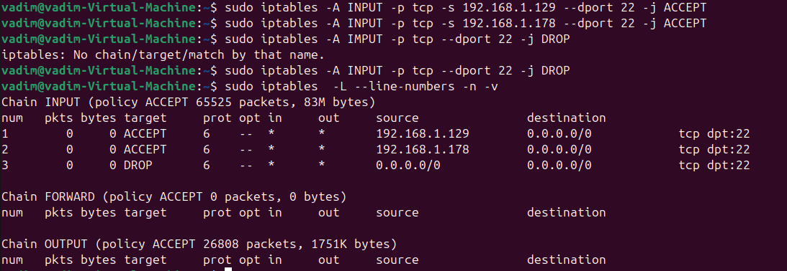
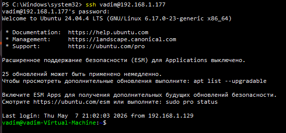
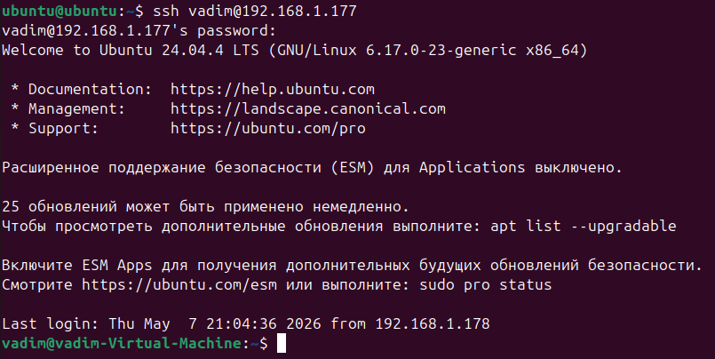
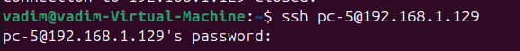
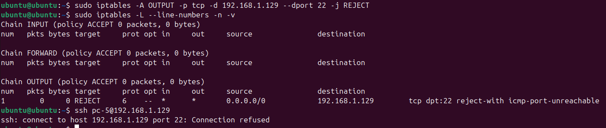

# Lesson 6. Создание SSH соединений между VM и хостовой ОС

Созданы 2 виртуальные машины с Ubuntu.

IP первой VM - `192.168.1.177/24`

IP второй VM - `192.168.1.178/24`

IP хоста - `192.168.1.129/24`

# Настройка VM1

```
sudo apt update
sudo apt install -y openssh-server iptables-persistent
sudo systemctl enable --now ssh
```

Открываю порт 22 только для IP VM2 и хоста:



Успешное подулючение к VM1 с хоста



Успешное подулючение к VM1 с VM2



Успешное подулючение к хосту с VM1



# Настройка VM2

Закрываю порт 22 на исходящий трафик до хоста


