# Lesson 10. Базовые команды Linux

---

## Задание 1. Текущий каталог, обозначение корня, абсолютный и относительный путь

Выполнено:

- Определён полный путь рабочей директории командой `pwd`.
- Корень файловой системы в Linux обозначается **`/`** (одинарный слэш).
- Путь, выводимый `pwd`, **абсолютный**, потому что начинается с `/`. Относительный путь не начинается с `/` (например `Documents` или `../etc`).

Команды:

```bash
pwd
```

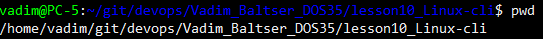

---

## Задание 2. Две подпапки в домашнем каталоге, просмотр текущего и родительского каталога

Созданы две поддиректории в домашнем каталоге, просмотрено содержимое текущего каталога и родительского.

Команды:

```bash
cd ~
mkdir dir1 dir2
ls -la
ls -la ..
```

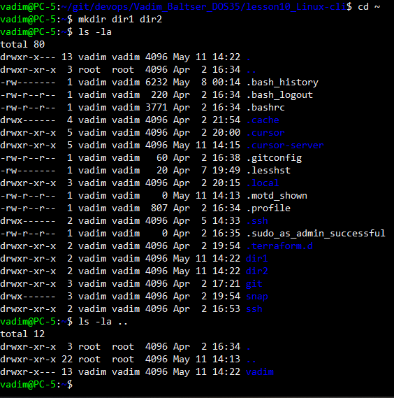

---

## Задание 3.

Переход в системную директорию (например `/etc`), просмотр её содержимого, просмотр содержимого исходного домашнего каталога без перехода в него, возврат в домашний каталог.

Команды:

```bash
cd /etc
ls -la
ls -la ~
cd ~
```

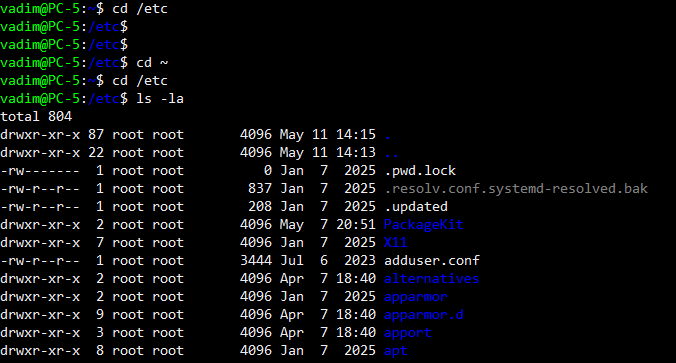

---

## Задание 4. Удаление двух подпапок из задания 2

Подпапки удалены. Для **пустых** каталогов `rmdir`

Команды:

```bash
cd ~
rmdir dir1 dir2
```

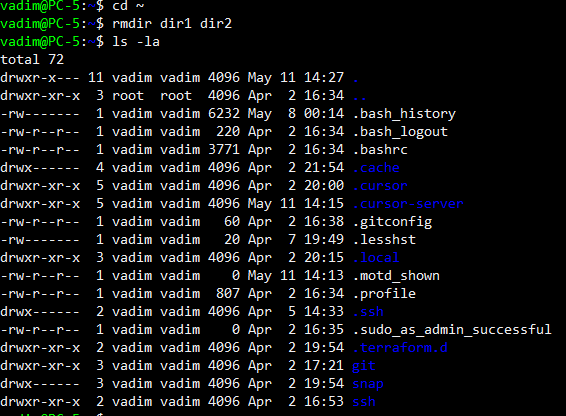

---

## Задание 5. Подробная справка: `man` для `ls` и `cd`, структура страницы

Открыты страницы справки `man ls` и `man cd`. 

Команды:

```bash
man ls
man cd
help cd
```

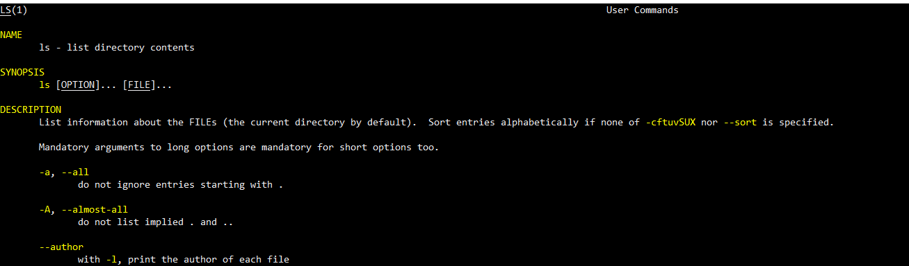

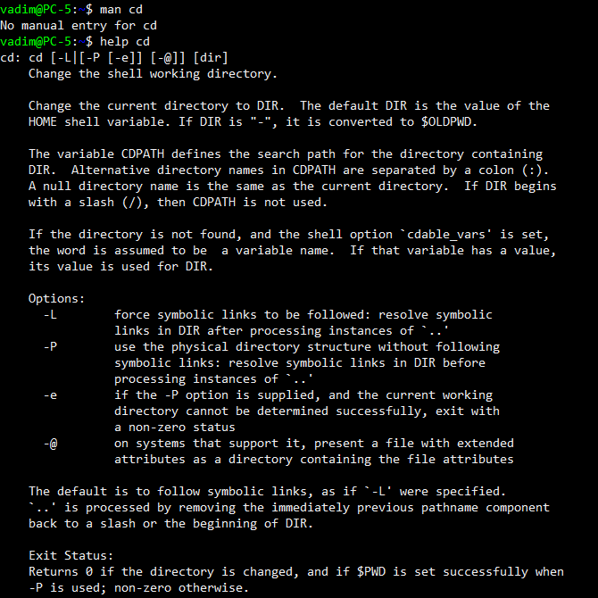

---

## Задание 6. `whatis` и `apropos`

- **`whatis`** — одна короткая строка по имени команды.
- **`apropos`** — **поиск** по ключевым словам по описаниям в справочной базе.

При пустом выводе `whatis` иногда помогает обновить базу: `sudo mandb`.

Команды:

```bash
whatis ls
whatis cd
apropos ls
```

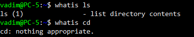

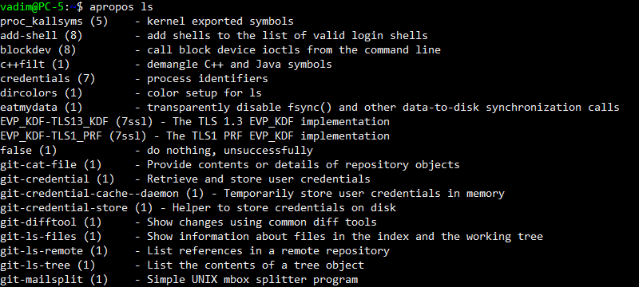
---

## Задание 7. Справка через `info`

Просмотр документации в формате `info` для `ls`.

Команды:

```bash
info ls
```

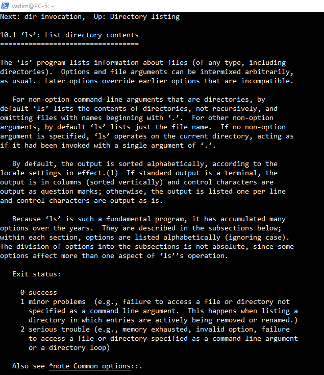

---

## Задание 8. Вложенная структура каталогов

Создана структура 

Команда:

```bash
mkdir -p ~/Baltser/1/2 ~/Baltser/1/3 ~/Baltser/4
tree ~/Baltser
```

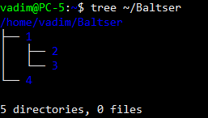

---

## Задание 9. Первые и последние 13 строк файла `/etc/group`

Команды:

```bash
head -n 13 /etc/group
tail -n 13 /etc/group
```

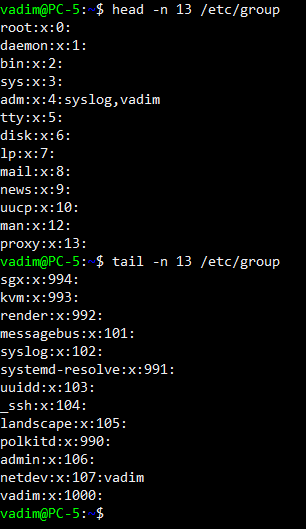
