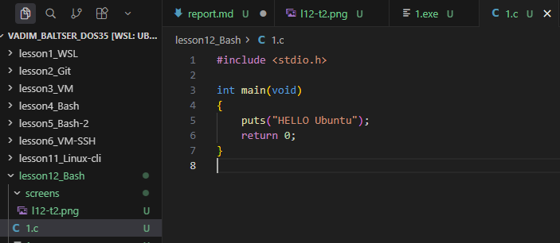
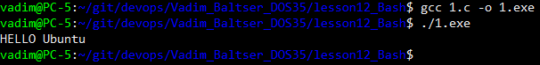
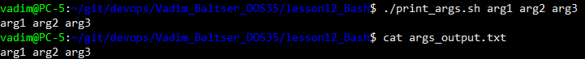
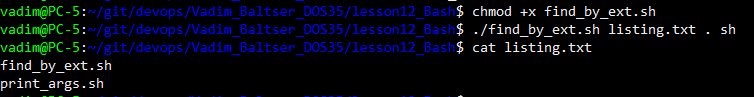

# Lesson 12. Bash

## Задание 1. Рабочий каталог для файлов заданий

В каталоге создана поддиректория в ней будут храниться файлы работы и текущий отчет.

Команды:

```bash
mkdir -p lesson12_Bash
```

## Задание 2. Программа на C: вывод «HELLO Ubuntu»

Создан файл `1.c`. Сборка и запуск:

```bash
sudo apt install gcc
gcc 1.c -o 1.exe
./1.exe
```

Исходный код в репозитории: `1.c`.





---

## Задание 3. Скрипт: аргументы в консоль и в файл

Написан скрипт `print_args.sh`.

Запуск (пример):

```bash
chmod +x print_args.sh
./print_args.sh arg1 arg2 arg3
cat args_output.txt
```



---

## Задание 4. Скрипт: список файлов по расширению

Написан скрипт `find_by_ext.sh` принимает три аргумента:

1. имя файла результата;
2. путь к каталогу поиска;
3. расширение.

В результат записываются имена найденных файлов, поиск выполняется рекурсивно в указанном дереве каталогов.

Пример:

```bash
chmod +x find_by_ext.sh
./find_by_ext.sh listing.txt . sh
cat listing.txt
```


