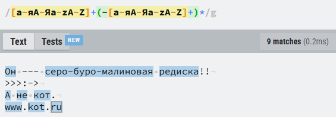
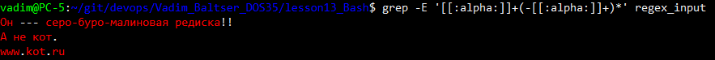
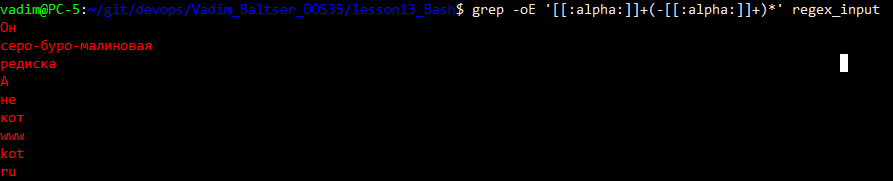
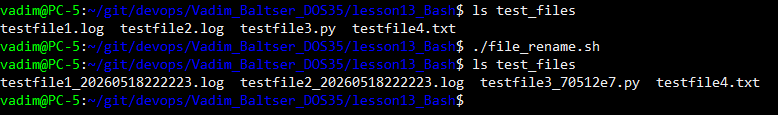

# Lesson 13. Bash

## Task1. Regex

Составил регулярное выражение для поиска слов с возможными дефисами внутри:

`[а-яА-Яa-zA-Z]+(-[а-яА-Яa-zA-Z]+)*`

Тестирование выражения:



Создал файл с тестовыми данными `regex_input`.

```
grep -E '[а-яА-Яa-zA-Z]+(-[а-яА-Яa-zA-Z]+)*' -c  regex_input
# grep: Invalid collation character
```

Ошибка появляется из‑за диапазона [а-яА-Я] при локали C.UTF-8. С кириллицей работает некорректно. В POSIX есть класс символов `[[:alpha:]]`. В шаблоне регулярного выражения он означает любую букву

Обновил команду: `grep -E '[[:alpha:]]+(-[[:alpha:]]+)*' regex_input`

Результат:



Добавил флаг -o, чтобы вывести каждое совпадение на отдельную строку:



Добавил команду `wc -l` для подсчета строк

```
grep -oE '[[:alpha:]]+(-[[:alpha:]]+)*' regex_input | wc -l
# 9
```

## Task2. Files rename

Написал скрипт `file_rename.sh`, котоырй переимновывает файлы, добавляя timestamp для .log файлов и хеш коммита для .py файлов.

Результат выполнения:

