# Отладка и оптимизация Bash-скриптов

## Task 1

### Отладка всего скрипта с флагом -x
Создал тестовый скрипт `task1_script.sh`

Запуск в режиме отладки:

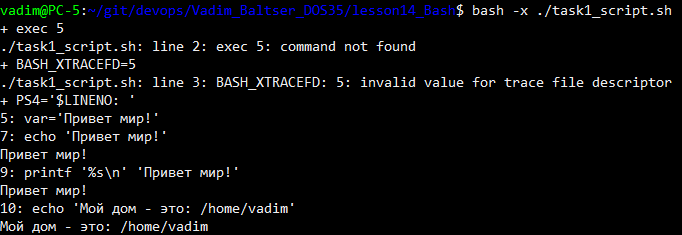

### Отладка части скрипта с set +/-x

Добавил опции `set -x` и `set +x` в скрипт.

Запуск скрипта:

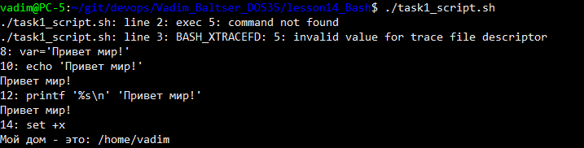

### Проверка на синтаксические ошибки

Создал файл с оскриптом для теста `task1_script1.sh`

Запуск проверки синтаксиса:

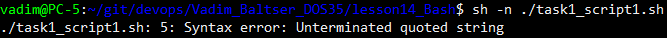

### Отображение команд сценария

Запуск скрипта с флагом -v:

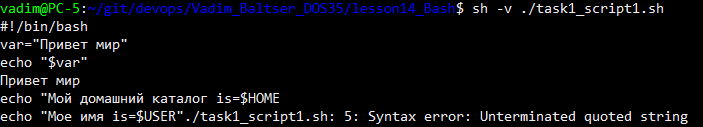

## Task 2. Bash скрипты №4

### Несколько пользователей в файле /var/users

Создал файл с несколькими пользователями `users`:

```
lessonuser1 it
lessonuser2 security
lessonuser3 users
```

Команда для просмотра только имён пользователей:

```bash
sudo cp users /var/users
cut -d' ' -f1 /var/users
```

Результат:

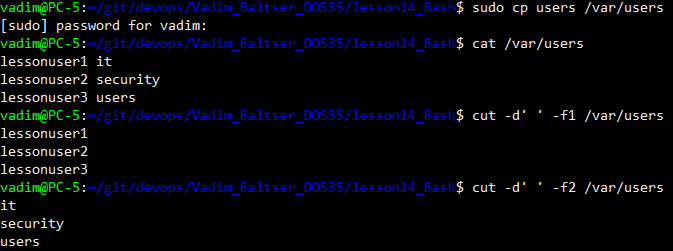

### Цикл for

Создал скрипт `for_demo.sh`:

```bash
for number in 1 two "line № 3"
do
  echo This is $number
done
```

Запуск:

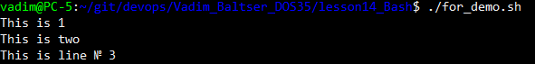

Создал скрипт `for_users.sh` читает файл построчно через `$(cat $file)`:

```bash
for line in $(cat "$file")
do
  echo In this line: $line
done
```

Запуск:

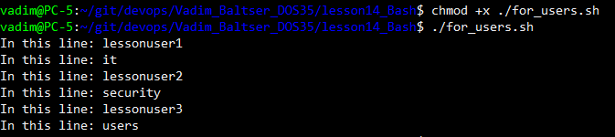

### Разделитель — перевод строки (IFS)

```bash
oldIFS=$IFS
IFS=$'\n'
# ... цикл ...
IFS=$oldIFS
```

Скрипт `for_users_ifs.sh` извлекает пользователя и группу через `cut`:

```bash
user=$(echo "$line" | cut -d' ' -f1)
group=$(echo "$line" | cut -d' ' -f2)
echo Username: $user Group: $group
```

Запуск:

```bash
./for_users_ifs.sh
```

Теперь на каждой итерации обрабатывается целая строка.

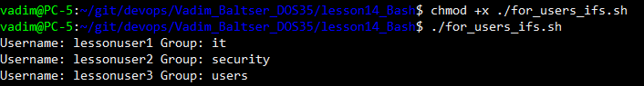

### Select

Скрипт `select_demo.sh`:

```bash
select number in 1 2 3
do
  echo This is number: $number
done
```

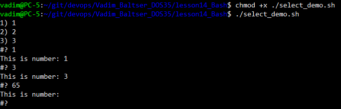

### Case

Скрипт `case_demo.sh`:

```bash
number=one
case $number in
  one) echo 1;;
  two) echo 2;;
  *) echo something wrong ;;
esac
```

`case` запускает команды в зависимости от значения переменной.

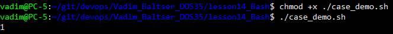

### select + case + break

В `select_case_demo.sh` объединены `select` и `case`; опция `stop` и команда `break` выходят из цикла:

```bash
select number in 1 2 3 stop
do
  case $number in
    1) echo One;;
    2) echo Two;;
    3) echo Three;;
    stop) break ;;
    *) echo something wrong ;;
  esac
done
```

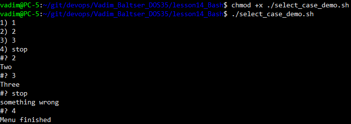
