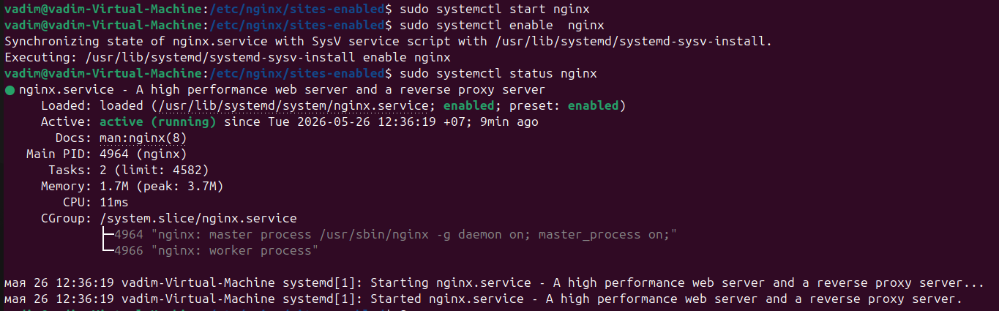
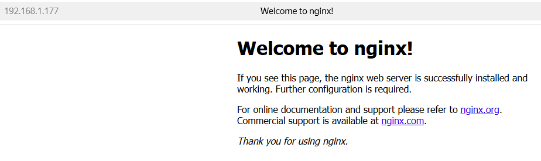
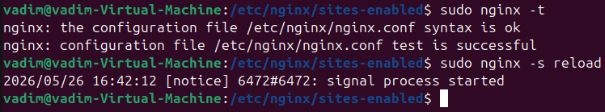
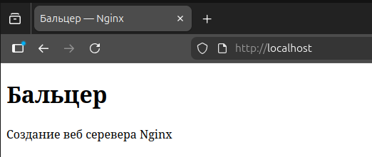
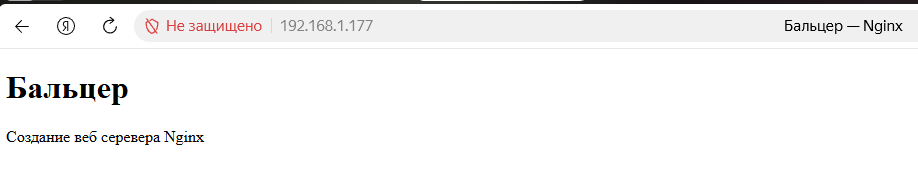
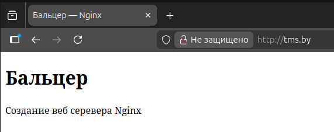
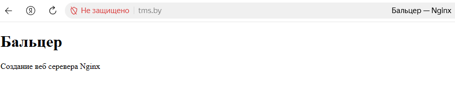

# Создание веб сервера Nginx

## Запуск nginx

Работу выполняю на виртуальной машине c ip `192.168.1.177`.

Установил nginx

`sudo apt install nginx`

Запустил службу

```
sudo systemctl start nginx
sudo systemctl enable nginx
sudo systemctl status nginx
```



Проверяю доступ с хостовой машины



Веб-сервер доступен 

## Настройка nginx

Создал каталог для сайта и положил в него `index.html`

```
sudo mkdir -p /var/www/tms.by
sudo cp ~/git/Vadim_Baltser_DOS35/lesson15_nginx/index.html /var/www/tms.by/index.html
```

Настроил конфиг следующим образом:

```nginx
server {
	listen 80 default_server;
	listen [::]:80 default_server;

	root /var/www/tms.by;

	server_name tms.by;

	index index.html;

	location / {
		try_files $uri $uri/ =404;
	}
}
```

Проверяю на корерктность конфиг и перезаграю его в nginx

```
sudo nginx -t
sudo nginx -s reload
```



Проверка на локальной машине (loopback):



Проверка на хостовой машине (ip vm):



## Настройка hosts

Сейчас адрес tms.by в браузере отправляет на сайт сантехника в Минске.

На локальной машине (VM) в `/etc/hosts` обновил запись для 127.0.0.1:

`127.0.0.1 localhost tms.by`

Теперь по пути http:/tms.by открывается index.html
Пришлось в браузере отключить DNS over HTTPS, иначе упорно открывал сайт с сантехником.



На хостовой машине (Windows) в `C:\Windows\System32\drivers\etc\hosts` добавил запись

`192.168.1.177 tms.by`



Теперь по пути http:/tms.by открывается index.html 
