# Урок 16. HTTPS для сайта cookzone.ru на Nginx (Certbot)

У меня уже был куплен домен `cookzone.ru` на `reg.ru`. Буду подключать его к веб-северу из прошлого урока и настраивтаь защищенное подключение.

---

## Настройка DNS на reg.ru

Сейчас домен открывает сайт-заглушку.

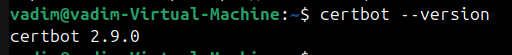

На сайте reg.ru добавляю ресурсные записи своего публичного IP

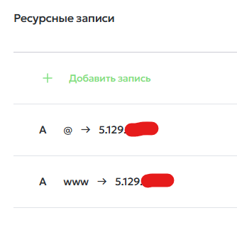

Настриваю роутер так, чтобы 80 и 443 порты пробрасывались к VM

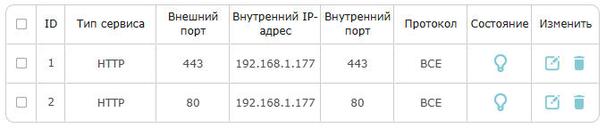

Теперь веб-сервер доступен по публичному IP

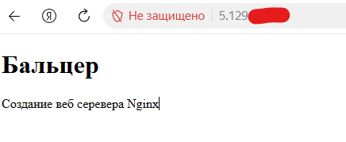

Через несколько часов обновились DNS записи, по домену стал открываться мой веб сервер:

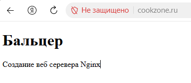

Проверка домена через `dig`:

```bash
dig +short cookzone.ru A 
```

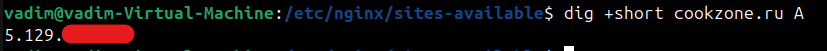

---

## Настройка веб-сервера

Создал отдельный каталог для сайта, html странцу скопировал из прошлого урока.

```bash
sudo mkdir -p /var/www/cookzone.ru
sudo cp ~/git/Vadim_Baltser_DOS35/lesson15_nginx/index.html /var/www/cookzone.ru/index.html
sudo chown -R www-data:www-data /var/www/cookzone.ru
```

Настроил nginx-конфиг следующим образом:

```nginx
server {
    listen 80;
    listen [::]:80;

    root /var/www/cookzone.ru;
    server_name cookzone.ru www.cookzone.ru;

    index index.html;

    location / {
        try_files $uri $uri/ =404;
    }
}
```

---

## Выпуск сертификата

Установил certbot:

```bash
sudo apt update
sudo apt install certbot python3-certbot-nginx -y
certbot --version
```

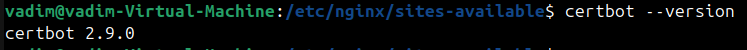

Выпуск сертификата:

```bash
sudo certbot --nginx -d cookzone.ru
```

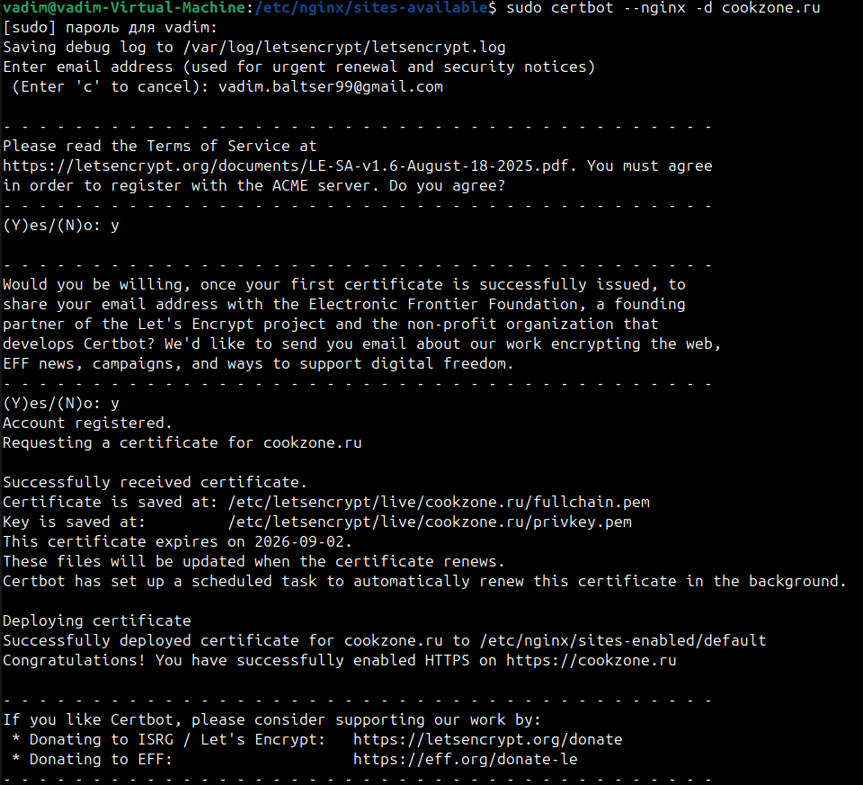

После этого certbot сам поменял nginx-конфиг:

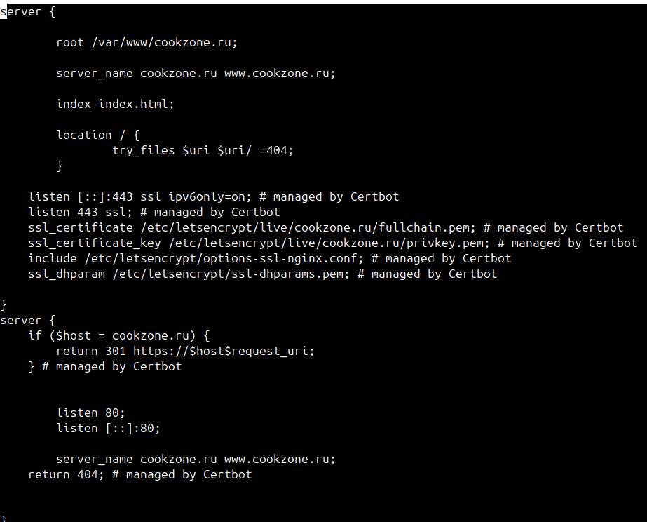

Теперь работает подключение через HTTPS к веб серверу

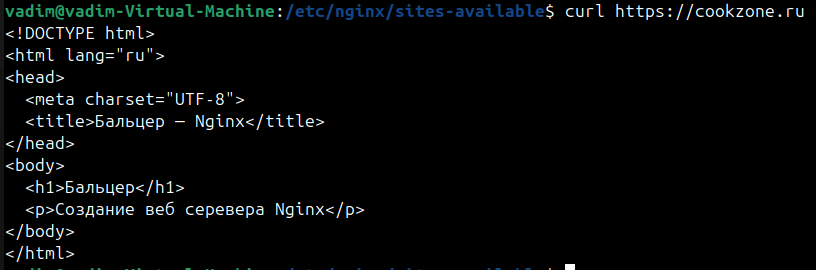

## Автоматическое продление сертификата

Certbot сам поставил systemd-таймер:

```bash
systemctl list-timers | grep certbot
systemctl cat certbot.timer
```

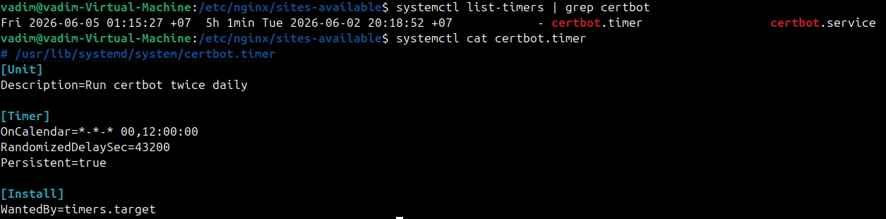