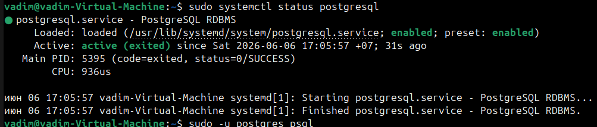
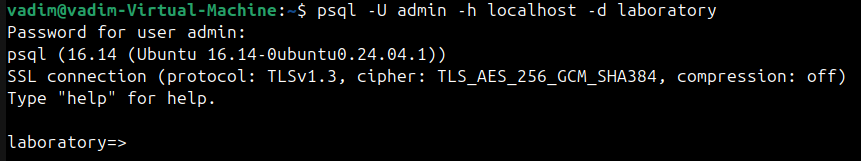
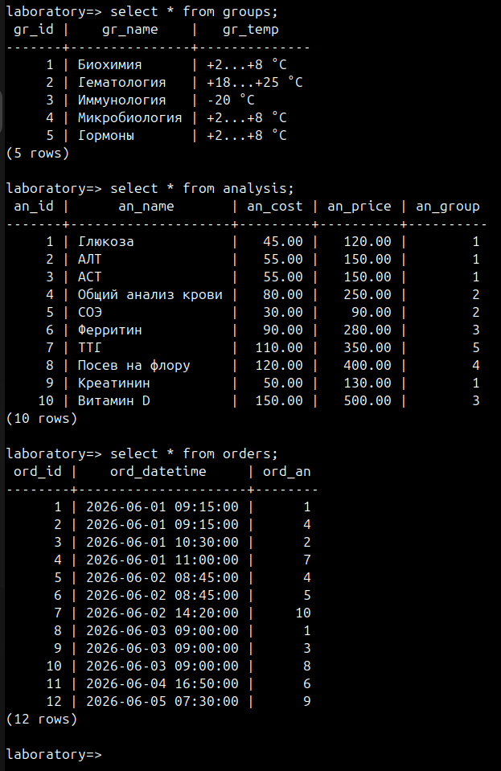
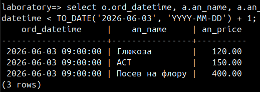
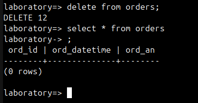
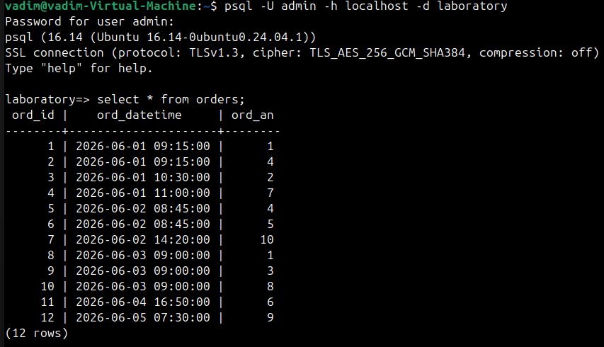
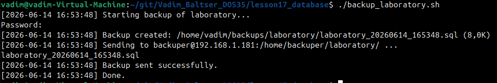
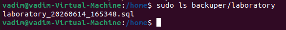
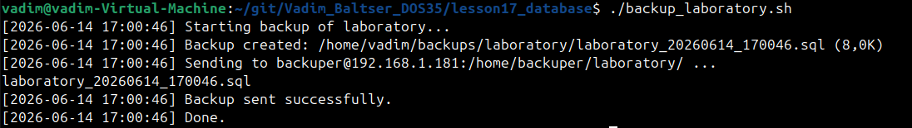

# Database. SQL

## Подготовка БД

Установил PostgreSql

```bash
sudo apt update
sudo apt install postgresql
sudo systemctl status postgresql
```



Создал нового пользователя `admin` и БД `laboratory`.
Выдал все права пользователю на БД.

```sql
CREATE USER admin WITH PASSWORD '123';
CREATE DATABASE laboratory OWNER admin;
GRANT ALL PRIVILEGES ON DATABASE laboratory TO admin;
```

Подключаюсь к БД под новым пользователем



## Создание структуры БД

```sql
CREATE TABLE groups (
    gr_id   SERIAL PRIMARY KEY,
    gr_name VARCHAR(100) NOT NULL,
    gr_temp VARCHAR(50)  NOT NULL
);

CREATE TABLE analysis (
    an_id    SERIAL PRIMARY KEY,
    an_name  VARCHAR(200) NOT NULL,
    an_cost  NUMERIC(10, 2) NOT NULL CHECK (an_cost >= 0),
    an_price NUMERIC(10, 2) NOT NULL CHECK (an_price >= 0),
    an_group INTEGER NOT NULL REFERENCES groups (gr_id)
);

CREATE TABLE orders (
    ord_id       SERIAL PRIMARY KEY,
    ord_datetime TIMESTAMP NOT NULL DEFAULT NOW(),
    ord_an       INTEGER NOT NULL REFERENCES analysis (an_id)
);
```

С помощью ИИ сгенерировал тестовые данные:

```sql
-- Группы анализов
INSERT INTO groups (gr_name, gr_temp) VALUES
    ('Биохимия',        '+2...+8 °C'),
    ('Гематология',     '+18...+25 °C'),
    ('Иммунология',     '-20 °C'),
    ('Микробиология',   '+2...+8 °C'),
    ('Гормоны',         '+2...+8 °C');
-- Анализы
INSERT INTO analysis (an_name, an_cost, an_price, an_group) VALUES
    ('Глюкоза',                    45.00,  120.00, 1),
    ('АЛТ',                        55.00,  150.00, 1),
    ('АСТ',                        55.00,  150.00, 1),
    ('Общий анализ крови',         80.00,  250.00, 2),
    ('СОЭ',                        30.00,   90.00, 2),
    ('Ферритин',                   90.00,  280.00, 3),
    ('ТТГ',                       110.00,  350.00, 5),
    ('Посев на флору',            120.00,  400.00, 4),
    ('Креатинин',                  50.00,  130.00, 1),
    ('Витамин D',                 150.00,  500.00, 3);
-- Заказы
INSERT INTO orders (ord_datetime, ord_an) VALUES
    ('2026-06-01 09:15:00', 1),
    ('2026-06-01 09:15:00', 4),
    ('2026-06-01 10:30:00', 2),
    ('2026-06-01 11:00:00', 7),
    ('2026-06-02 08:45:00', 4),
    ('2026-06-02 08:45:00', 5),
    ('2026-06-02 14:20:00', 10),
    ('2026-06-03 09:00:00', 1),
    ('2026-06-03 09:00:00', 3),
    ('2026-06-03 09:00:00', 8),
    ('2026-06-04 16:50:00', 6),
    ('2026-06-05 07:30:00', 9);
```



## Написание sql-запросов 

Написал sql-запрос, который выводит список анализов после 2026.06.03, где вместо `1` можно подставлять количество дней:

```sql
select o.ord_datetime, a.an_name, a.an_price 
from orders o 
left join analysis a on o.ord_an = a.an_id 
where 
        o.ord_datetime > TO_DATE('2026-06-03', 'YYYY-MM-DD')
    and o.ord_datetime > TO_DATE('2026-06-03', 'YYYY-MM-DD') + 1;
```

Результат:



## Бэкапы

Создал бэкап с помощью комнады:

```bash
pg_dump -U admin -h localhost -d laboratory -F p -f ~/git/Vadim_Baltser_DOS35/lesson17_database/laboratory_backup.sql
```

Удалил все данные из таблицы `orders`



Восстанавливаю БД из дампа комнадой:

```sql
psql -U admin -h localhost -d laboratory -f ~/git/Vadim_Baltser_DOS35/lesson17_database/laboratory_backup.sql
```

Данные восстановлены:



## Скрипт автоматического бэкапа

Создал скрипт `backup_laboratory.sh` для автоматичксого бэкапа БД.

VM2 (192.168.1.181) выступает в роли удаленного сервера-хранилища бэкапов. На ней создал пользователя под которым будет подключаться VM1, на которой БД. Также создал каталог для бэкапов и утсановил сервер ssh

```bash
sudo apt install -y openssh-server
sudo useradd -m backuper
sudo passwd backuper
sudo mkdir -p /home/backuper/laboratory
sudo chown backuper:backuper /home/backuper/laboratory
```

На VM1 создал ключ-ssh для подключения к VM2:

```bash
ssh-keygen -t ed25519 -f ~/.ssh/id_rsa -N ""
ssh-copy-d backuper@192.168.1.181
```

Проверяю запуск скрипта на VM1:



На VM2 появился бэкап:



Но pg_dump запрашивает пароль, что не подходит для автоматического бэкапа. Для этого создаю файл с параметрами подключения к БД:

```bash
echo 'localhost:5432:laboratory:admin:kek' >> ~/.pgpass
chmod 600 ~/.pgpass
```

Теперь БД не запрашивает пароль:



Добавляю запись в `crontab -e` для автоматического бэкапа:

```
0 3 * * * /home/vadim/git/Vadim_Baltser_DOS35/lesson17_database/backup_laboratory.sh >> var/log/laboratory_backup.log 2>&1
```
