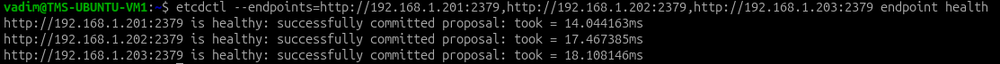
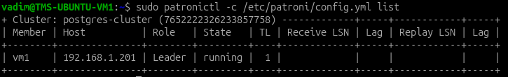
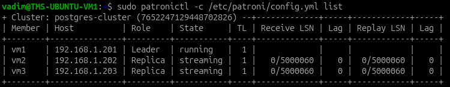
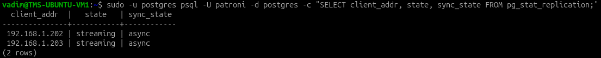
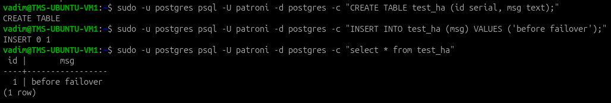
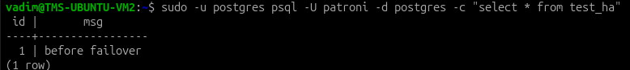
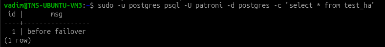
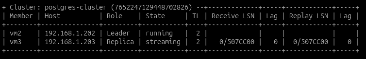

# Database. Репликации

```
VM1 - 192.168.1.201 - primary
VM2 - 192.168.1.202 - replica
VM3 - 192.168.1.203 - replica
```

На VM1 у меня работает БД PostgreSQL с прошлого урока. В этом уроке буду устанавливать на VM2 и VM3 PostgreSQL и настраивать реплику с VM1.

## Подготовка на всех VM

Установка пакетов:

```bash
sudo apt update
sudo apt install -y postgresql postgresql-contrib 
sudo apt install -y etcd-server etcd-client
sudo apt install -y patroni python3-psycopg2
sudo apt install -y python3-etcd python3-etcd3gw
```

Создал пользователя для репликации и для patroni на VM1:

```sql
CREATE USER replicator WITH REPLICATION ENCRYPTED PASSWORD 'strong_pwd';
CREATE USER patroni WITH ENCRYPTED PASSWORD 'patroni_pwd';
ALTER USER patroni WITH SUPERUSER;
```

Остановка PostgreSQL, т.к. им управлять будет Patroni

```bash
sudo systemctl stop postgresql
sudo systemctl disable postgresql
```

## Кластер etcd

Создал конфиги для etcd в `/etc/default/etcd`:

На VM1:

```
ETCD_NAME="vm1"
ETCD_INITIAL_CLUSTER="vm1=http://192.168.1.201:2380,vm2=http://192.168.1.202:2380,vm3=http://192.168.1.203:2380"
ETCD_INITIAL_CLUSTER_STATE="new"
ETCD_INITIAL_CLUSTER_TOKEN="postgres-cluster"
ETCD_LISTEN_PEER_URLS="http://192.168.1.201:2380"
ETCD_LISTEN_CLIENT_URLS="http://192.168.1.201:2379"
ETCD_ADVERTISE_CLIENT_URLS="http://192.168.1.201:2379"
ETCD_INITIAL_ADVERTISE_PEER_URLS="http://192.168.1.201:2380"
```

На VM2:

```
ETCD_NAME="vm2"
ETCD_INITIAL_CLUSTER="vm1=http://192.168.1.201:2380,vm2=http://192.168.1.202:2380,vm3=http://192.168.1.203:2380"
ETCD_INITIAL_CLUSTER_STATE="new"
ETCD_INITIAL_CLUSTER_TOKEN="postgres-cluster"
ETCD_LISTEN_PEER_URLS="http://192.168.1.202:2380"
ETCD_LISTEN_CLIENT_URLS="http://192.168.1.202:2379"
ETCD_ADVERTISE_CLIENT_URLS="http://192.168.1.202:2379"
ETCD_INITIAL_ADVERTISE_PEER_URLS="http://192.168.1.202:2380"
```

На VM3:

```
ETCD_NAME="vm3"
ETCD_INITIAL_CLUSTER="vm1=http://192.168.1.201:2380,vm2=http://192.168.1.202:2380,vm3=http://192.168.1.203:2380"
ETCD_INITIAL_CLUSTER_STATE="new"
ETCD_INITIAL_CLUSTER_TOKEN="postgres-cluster"
ETCD_LISTEN_PEER_URLS="http://192.168.1.203:2380"
ETCD_LISTEN_CLIENT_URLS="http://192.168.1.203:2379"
ETCD_ADVERTISE_CLIENT_URLS="http://192.168.1.203:2379"
ETCD_INITIAL_ADVERTISE_PEER_URLS="http://192.168.1.203:2380"
```

Запуск etcd

```bash
sudo systemctl enable etcd
sudo systemctl start etcd
sudo systemctl status etcd
```

Проверка кластера:



## Настройка patroni

Создал config файлы patroni:

На VM1:

```yml
scope: postgres-cluster
namespace: /db/
name: vm1

restapi:
  listen: 192.168.1.201:8008
  connect_address: 192.168.1.201:8008

etcd3:
  hosts:
    - 192.168.1.201:2379
    - 192.168.1.202:2379
    - 192.168.1.203:2379

bootstrap:
  dcs:
    ttl: 30
    loop_wait: 10
    retry_timeout: 10
    maximum_lag_on_failover: 1048576
    postgresql:
      use_pg_rewind: true
      parameters:
        wal_level: replica
        hot_standby: "on"
        max_wal_senders: 10
        max_replication_slots: 10
        wal_keep_size: 512MB

  initdb:
    - encoding: UTF8
    - data-checksums

  pg_hba:
    - host replication replicator 192.168.1.0/24 md5
    - host all all 192.168.1.0/24 md5
    - host all all 0.0.0.0/0 md5

  users:
    replicator:
      password: strong_pwd
      options:
        - replication

postgresql:
  listen: 0.0.0.0:5432
  connect_address: 192.168.1.201:5432
  data_dir: /var/lib/postgresql/18/main
  bin_dir: /usr/lib/postgresql/18/bin
  authentication:
    replication:
      username: replicator
      password: strong_pwd
    superuser:
      username: patroni
      password: patroni_pwd
  parameters:
    unix_socket_directories: '/var/run/postgresql'

tags:
  nofailover: false
  noloadbalance: false
  clonefrom: false
  nosync: false
```

На VM2 также как VM1 без bootstrap и заменой:

```yml
name: vm2

restapi:
  listen: 192.168.1.202:8008
  connect_address: 192.168.1.202:8008

postgresql:
  connect_address: 192.168.1.202:5432
```

На VM3 также как VM1 без bootstrap и заменой:

```yml
name: vm3

restapi:
  listen: 192.168.1.203:8008
  connect_address: 192.168.1.203:8008

postgresql:
  connect_address: 192.168.1.203:5432
```

## Запуск patroni

Запуск bootstrap на vm1:

```bash
sudo systemctl enable patroni
sudo systemctl start patroni
patronictl -c /etc/patroni/config.yml list
```



Запуск bootstrap на vm2 и vm3:

```bash
sudo systemctl enable patroni
sudo systemctl start patroni
```



Проверка репликации:

```bash
sudo -u postgres psql -U patroni -d postgres -c "SELECT client_addr, state, sync_state FROM pg_stat_replication;"
```



Создаю таблицу и запись в ней с VM1



Запрос к таблице с VM2 и VM3





## Проверки

Имимтация падения мастера на VM1:

```bash
sudo systemctl stop patroni
```

Лидером стал vm2:




