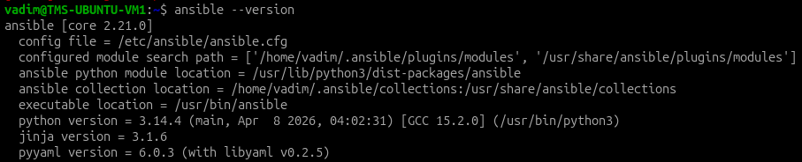
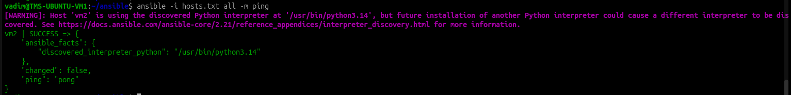
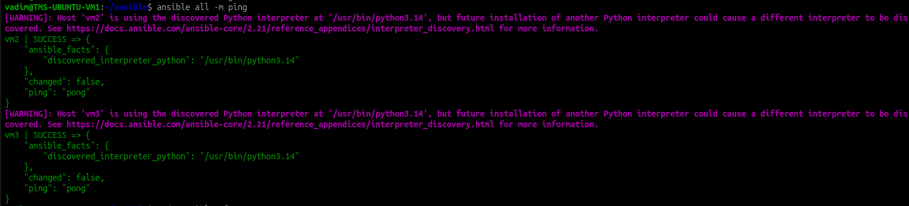
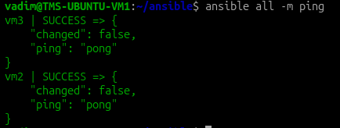

# Ansible

У меня есть 3 VM:

```
VM1 - 192.168.1.201 - main
VM2 - 192.168.1.202
VM3 - 192.168.1.203
```

Планирую управлять с VM1 машинами VM2 и VM3

## Установка

Установил Ansible на VM1

```bash
sudo apt update
sudo apt install software-properties-common
sudo apt-add-repository ppa:ansible/ansible
sudo apt update
sudo apt install ansible
ansible --version
```



## Настройка SSH

Установил ssh-сервер на всех 3х VM

```bash
sudo apt update
sudo apt install -y openssh-server
sudo systemctl enable --now ssh
```

На VM1 создал ssh-ключ и скопировал его на VM2 и VM3

```bash
ssh-keygen -t ed25519 -f ~/.ssh/id_ed25519 -N ""
ssh-copy-id -i ~/.ssh/id_ed25519.pub vadim@192.168.1.202
ssh-copy-id -i ~/.ssh/id_ed25519.pub vadim@192.168.1.203
```

## Настройка ansible

### Пробное подключение к VM2
Создал файл `hosts.txt`:

```ansible
[staging_servers]
vm2 ansible_host=192.168.1.202  ansible_user=vadim  ansible_ssh_private_key_file=/home/vadim/.ssh/id_ed25519
```

Выполнил команду

```bash
ansible -i hosts.txt all -m ping
```



VM2 пингуется

### Подключение к VM3

Обновил `hosts.txt`

```ansible

[staging_servers]
vm2 ansible_host=192.168.1.202  ansible_user=vadim  ansible_ssh_private_key_file=/home/vadim/.ssh/id_ed25519

[prod_servers]
vm2 ansible_host=192.168.1.202  ansible_user=vadim  ansible_ssh_private_key_file=/home/vadim/.ssh/id_ed25519
vm3 ansible_host=192.168.1.203  ansible_user=vadim  ansible_ssh_private_key_file=/home/vadim/.ssh/id_ed25519
```

Создал `ansible.cfg`

```cfg
[defaults]
host_key_checking   = false
inventory           = ./hosts.txt
```

Выполнил команду `ansible all -m ping`:



При выполнении появляюься варнинги, которые предупреждают о том, что если на удаленной машине появится интерпретатор, то разные модули ansible могут начать использовать его, что приведет к неожиданным результатам.

Обновил hosts.txt, указав конкретный интерпретатор:

```ansible
[staging_servers]
vm2 ansible_host=192.168.1.202 ansible_user=vadim ansible_ssh_private_key_file=/home/vadim/.ssh/id_ed25519 ansible_python_interpreter=/usr/bin/python3

[prod_servers]
vm2 ansible_host=192.168.1.202 ansible_user=vadim ansible_ssh_private_key_file=/home/vadim/.ssh/id_ed25519 ansible_python_interpreter=/usr/bin/python3
vm3 ansible_host=192.168.1.203 ansible_user=vadim ansible_ssh_private_key_file=/home/vadim/.ssh/id_ed25519 ansible_python_interpreter=/usr/bin/python3
```

