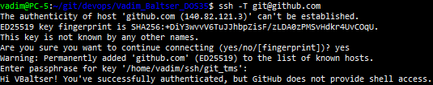
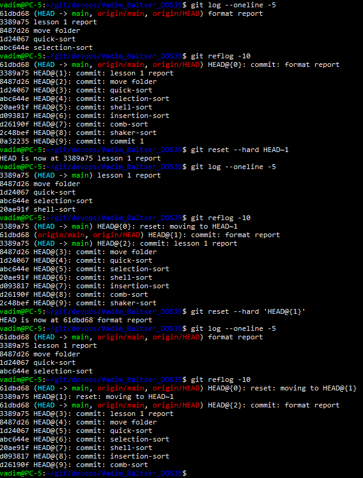
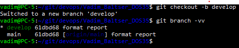
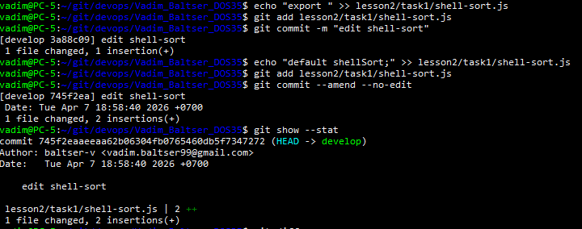
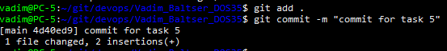
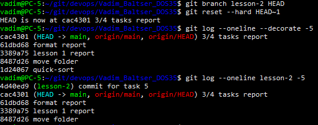
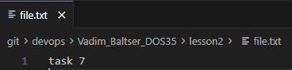
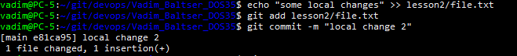
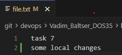
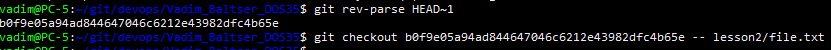

# Lesson 2

## Task 0. Подключение Git-репозитория.
1) Создал SSH-ключ в github.
2) Создал файл с ssh-ключом `git_tms` в `/home/vadim/ssh/git_tms`
3) Создал config-файл в .ssh
```
Host github.com
    HostName github.com
    User git
    IdentityFile /home/vadim/ssh/git_tms
    IdentitiesOnly yes
```
4) Проверяем доступ к репозиторию:

```ssh -T git@github.com```



## Task 1. 5-10 коммитов
Создал 7 коммитов с js-файлами:

`git log --oneline --decorate -15`


## Task 2. Reflog
``` 
git log --oneline -5
git reflog -10
git reset --hard HEAD~1
git log --oneline -5
git reflog -10
git reset --hard 'HEAD@{1}'
git log --oneline -5
git reflog -10
```



## Task 3. New branch

```
git checkout -b develop
git branch -vv
```


## Task 4. Ammend

```
echo "export " >> lesson2/task1/shell-sort.js
git add lesson2/task1/shell-sort.js
git commit -m "edit shell-sort"

echo "default shellSort;" >> lesson2/task1/shell-sort.js
git add lesson2/task1/shell-sort.js
git commit --amend --no-edit
git show --stat
```



## Task 5-6. Reset --hard

```
git add .
git commit -m "commit for task 5"
```



```
git branch lesson-2 HEAD
git reset --hard HEAD~1
git log --oneline --decorate -5
git log --oneline lesson-2 -5
```



## Task 7-8 . Checkout

Создал файл и закоммитил его.

```
echo "task 7" >> lesson2/file.txt
git add lesson2/file.txt
git commit -m "local change"
```



Внес изменения в файл и закомитил их

```
echo "some local changes" >> lesson2/file.txt
git add lesson2/file.txt
git commit -m "local change 2"
```





Восставновил файл к состоянию предыдущего коммита

```
git rev-parse HEAD~1
git checkout b0f9e05a94ad844647046c6212e43982dfc4b65e -- lesson2/file.txt
```

