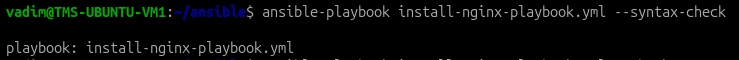
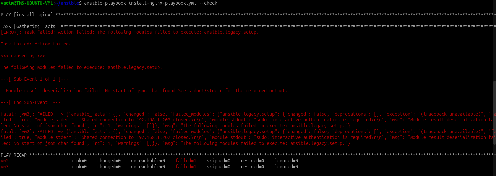
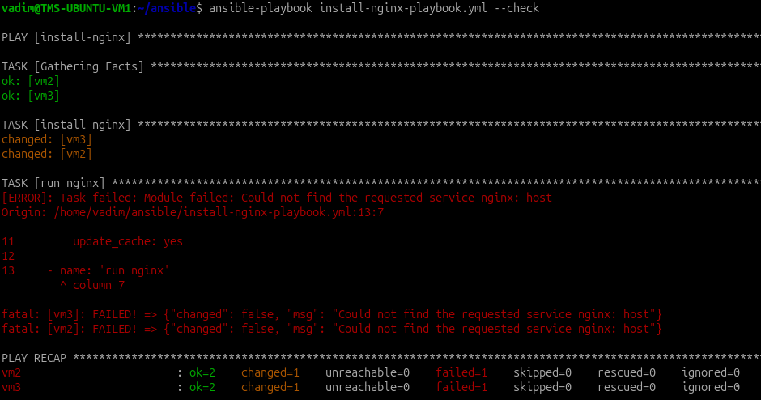
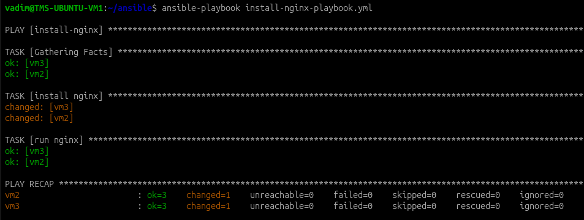
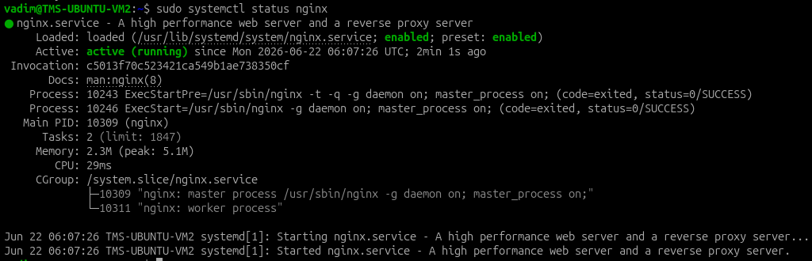

# Ansible

У меня есть 3 VM:

```
VM1 - 192.168.1.201 - main
VM2 - 192.168.1.202
VM3 - 192.168.1.203
```

В этом уроке буду использовать конфиг-файлы из прошлого урока:

`hosts.txt:`

```ini
[staging_servers]
vm2 ansible_host=192.168.1.202 ansible_user=vadim ansible_ssh_private_key_file=/home/vadim/.ssh/id_ed25519 ansible_python_interpreter=/usr/bin/python3

[prod_servers]
vm2 ansible_host=192.168.1.202 ansible_user=vadim ansible_ssh_private_key_file=/home/vadim/.ssh/id_ed25519 ansible_python_interpreter=/usr/bin/python3
vm3 ansible_host=192.168.1.203 ansible_user=vadim ansible_ssh_private_key_file=/home/vadim/.ssh/id_ed25519 ansible_python_interpreter=/usr/bin/python3
```

`ansible.cfg:`

```ini
host_key_checking   = false
inventory           = ./hosts.txt
```

## Доработка существующих конфигов

Вынес из `hosts.txt` повторяющиеся параметры в `ansible.cfg`, получились следующие конфиги:

```ini
vm2 ansible_host=192.168.1.202
vm3 ansible_host=192.168.1.203
```

```ini
[defaults]
host_key_checking               = false
inventory                       = ./hosts.txt
ansible_user                    = vadim 
ansible_ssh_private_key_file    = /home/vadim/.ssh/id_ed25519 
interpreter_python              = /usr/bin/python3
```

## Создание playbook для установки nginx

Создал `install-nginx-playbook.yml`, который установит и запустит nginx

```yml
---
- name: install-nginx
  hosts: all
  
  tasks:
    - name: 'install nginx'
      ansible.builtin.apt:
        name: nginx
        state: present
        update_cache: yes

    - name: 'run nginx'
      ansible.builtin.service:
        name: nginx
        state: started
        enabled: yes
```

Проверка синтаксиса:



Тестовый прогон скрипта:



На VM2 и VM3 пользователь vadim может использовать sudo только с паролем, а Ansible пароль не передаёт.

На VM2 и VM3 создал нового пользователя `ansible`

```bash
sudo adduser --disabled-password --gecos "" ansible
```

Выдал пользователю `ansible` права выполнять команды под sudo без пароля.

```bash
echo 'ansible ALL=(ALL) NOPASSWD:ALL' | sudo tee /etc/sudoers.d/ansible
sudo chmod 440 /etc/sudoers.d/ansible
```

Создал новый ssh ключ на VM1. После этого обновил `ansible.cfg`. Теперь подключение под пользователем ansible:

```ini
[defaults]
host_key_checking               = false
inventory                       = ./hosts.txt
remote_user                     = ansible 
private_key_file                = /home/vadim/.ssh/ansible 
interpreter_python              = /usr/bin/python3
```

Обновил `install-nginx-playbook.yml`. Вынес параметр `become: yes` на уровень task, чтобы sudo права не запрашивались на этапе `Gathering Facts`. 

```yml
---
- name: install-nginx
  hosts: all
  
  tasks:
    - name: 'install nginx'
      become: yes
      ansible.builtin.apt:
        name: nginx
        state: present
        update_cache: yes

    - name: 'run nginx'
      become: yes
      ansible.builtin.service:
        name: nginx
        state: started
        enabled: yes
```

Тестовый прогон скрипта:



Не сработал этап `run nginx`, т.к. это тестовый прогон с флагом `--check` и реально nginx не установился.

Реальное выполнение:



nginx на VM2 запущен:

