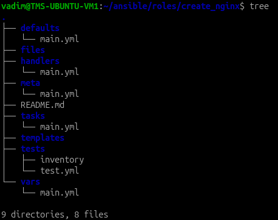
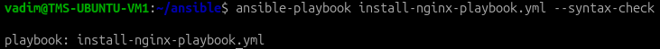
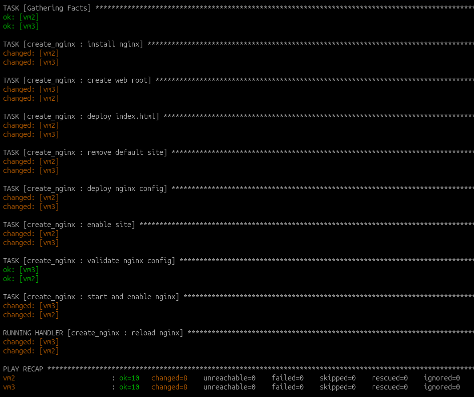
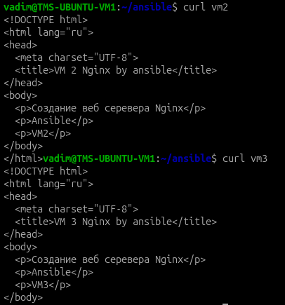

# Ansible. Роли

У меня есть 3 VM:

```
VM1 - 192.168.1.201 - main
VM2 - 192.168.1.202
VM3 - 192.168.1.203
```

В этом уроке буду делать ansible-роль, которая будет устанавливать nginx на сервера, настраивать веб-сервер.

## Создание структуры

```bash
mkdir roles
cd roles
ansible-galaxy init create_nginx
tree
```



## Редактирование общих настроек ansible

В `ansible.cfg` добавил `roles_path = ./roles`

```ini
[defaults]
host_key_checking               = false
inventory                       = ./hosts.txt
remote_user                     = ansible 
private_key_file                = /home/vadim/.ssh/ansible 
interpreter_python              = /usr/bin/python3
roles_path                      = ./roles
```

Обновил `hosts.txt`. Добавиил переменные специфичные конретным машинам и серверам на них

```ini
vm2 ansible_host=192.168.1.202 web_root=/var/www/my_web_site server_name=vm2-server index_file=index-vm2.html
vm3 ansible_host=192.168.1.203 web_root=/var/www/my_web_site server_name=vm3-server index_file=index-vm3.html
```

обновил `install-nginx-playbook.yml`. Теперь он выполняет роль:

```yml
---
- name: install-nginx
  hosts: all
  roles:
    - create_nginx
```

## Настройка роли

### Default 

`roles/create_nginx/defaults/main.yml`

В деволтные значения вынес настройки nginx:

```yml
---
nginx_package: nginx
web_root: /var/www/my_web_site
server_name: default-server
index_file: index.html
nginx_site_name: my_web_site
```

### Template 

Создал шаблон nginx-config, в котором буду подставляться переданные переменные:

```
server {
    listen 80 default_server;
    listen [::]:80 default_server;

    root {{ web_root }};
    server_name {{ server_name }};

    index index.html;

    location / {
        try_files $uri $uri/ =404;
    }
}
```

### Task

Задачи, которые выполняет роль:
- `install nginx` - Установка nginx
- `create web root` - Создает директорию под index файл с необходимыми правами
- `deploy index.html` - Отправит с VM1 на целевую машину index файл согласно переменной `index_file`
- `remove default site` - Удаление дефолтного nginx конфига для избежания коллизий
- `deploy nginx config` - Создание nginx конфига по шаблону
- `enable site` - "Включение" сайта. Создание simlink в каталог sites-enabled\
- `validate nginx config` - Проверка на корректность nginx-конфига
- `start and enable nginx` - Запуск службы nginx 

```yml
---
- name: install nginx
  become: true
  ansible.builtin.apt:
    name: "nginx"
    state: present
    update_cache: true

- name: create web root
  become: true
  ansible.builtin.file:
    path: "{{ web_root }}"
    state: directory
    owner: www-data
    group: www-data
    mode: "0755"

- name: deploy index.html
  become: true
  ansible.builtin.copy:
    src: "{{ index_file }}"
    dest: "{{ web_root }}/index.html"
    owner: www-data
    group: www-data
    mode: "0644"

- name: remove default site
  become: true
  ansible.builtin.file:
    path: /etc/nginx/sites-enabled/default
    state: absent
  notify: reload nginx

- name: deploy nginx config
  become: true
  ansible.builtin.template:
    src: nginx-site.conf.j2
    dest: "/etc/nginx/sites-available/{{ nginx_site_name }}"
    mode: "0644"
  notify: reload nginx

- name: enable site
  become: true
  ansible.builtin.file:
    src: "/etc/nginx/sites-available/{{ nginx_site_name }}"
    dest: "/etc/nginx/sites-enabled/{{ nginx_site_name }}"
    state: link
  notify: reload nginx

- name: validate nginx config
  become: true
  ansible.builtin.command: nginx -t
  changed_when: false

- name: start and enable nginx
  become: true
  ansible.builtin.service:
    name: nginx
    state: started
    enabled: true
```

### Handler 

Добавил handler, который будет перезапускать сервис nginx при каких-либо изменениях на сервере

`roles/create_nginx/handlers/main.yml`

```yml
---
- name: reload nginx
  become: true
  ansible.builtin.service:
    name: nginx
    state: reloaded
```

### Files

Создал index файлы, которые будут деплоиться в задаче `deploy index.html`

```html
<!DOCTYPE html>
<html lang="ru">
<head>
  <meta charset="UTF-8">
  <title>VM 2 Nginx by ansible</title>
</head>
<body>
  <p>Создание веб серевера Nginx</p>
  <p>Ansible</p>
  <p>VM2</p>
</body>
</html>
```

```html
<!DOCTYPE html>
<html lang="ru">
<head>
  <meta charset="UTF-8">
  <title>VM 3 Nginx by ansible</title>
</head>
<body>
  <p>Создание веб серевера Nginx</p>
  <p>Ansible</p>
  <p>VM3</p>
</body>
</html>
```

## Запуск

`ansible-playbook install-nginx-playbook.yml --syntax-check`



`ansible-playbook install-nginx-playbook.yml`



Проверка доступности сайтов:


