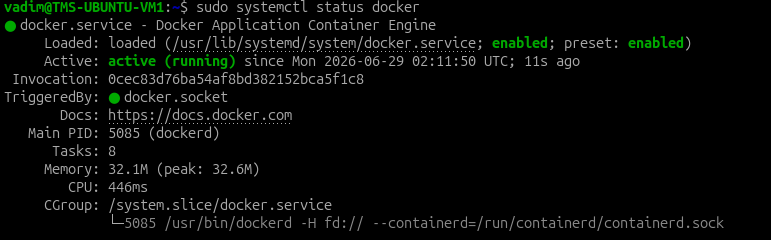
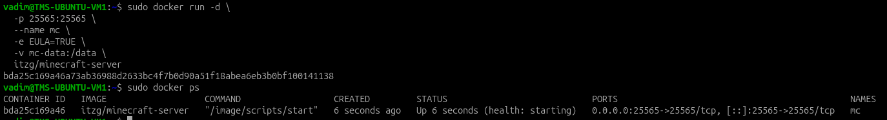
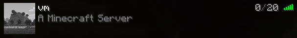
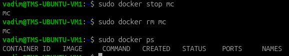

# Docker

## Установка

Установил Docker по официальной инструкции

Удаление старых компонентов

```bash
sudo apt remove $(dpkg --get-selections docker.io docker-compose docker-compose-v2 docker-doc podman-docker containerd runc | cut -f1)
```

Установка apt репозитория

```bash
sudo apt update
sudo apt install ca-certificates curl
sudo install -m 0755 -d /etc/apt/keyrings
sudo curl -fsSL https://download.docker.com/linux/ubuntu/gpg -o /etc/apt/keyrings/docker.asc
sudo chmod a+r /etc/apt/keyrings/docker.asc
```

Установка пакетов Docker

```bash
sudo apt install docker-ce docker-ce-cli containerd.io docker-buildx-plugin docker-compose-plugin
```

Сервис докера запущен:

```bash
sudo systemctl status docker
```



## Pull и запуск контейнера

```bash
sudo docker run -d \
  -p 25565:25565 \
  --name mc \
  -e EULA=TRUE \
  -v mc-data:/data \
  itzg/minecraft-server
```

```bash
sudo docker ps
```



Minecraft сервер доступен:



## Удаление контейнера

```bash
sudo docker stop mc
sudo docker rm mc
sudo docker ps
```



## Оптимизация места на диске

Список образов:

```bash
vadim@TMS-UBUNTU-VM1:~$ sudo docker images 
IMAGE                          ID             DISK USAGE   CONTENT SIZE   EXTRA
itzg/minecraft-server:latest   e77d5de73b29       1.23GB          341MB 
```

Общая статистика дискового пространства докера. Видно, что занимает место образ сервера и локальные данные сервера.

```bash
vadim@TMS-UBUNTU-VM1:~$ sudo docker system df 
TYPE            TOTAL     ACTIVE    SIZE      RECLAIMABLE
Images          1         0         1.231GB   1.231GB (99%)
Containers      0         0         0B        0B
Local Volumes   1         0         138.6MB   138.6MB (100%)
Build Cache     0         0         0B        0B
```

Inspect образа:

```bash
sudo docker inspect e77d5de73b29
```

```json
"Size": 341435854,
```

Размеры всех слоев в образе:

```bash
sudo docker history --human itzg/minecraft-server
```

```
vadim@TMS-UBUNTU-VM1:~$ sudo docker history --human itzg/minecraft-server
IMAGE          CREATED       CREATED BY                                      SIZE      COMMENT
e77d5de73b29   2 days ago    COPY <<EOF /etc/image.properties # buildkit     12.3kB    buildkit.dockerfile.v0
<missing>      2 days ago    ARG REVISION=f1dd0f3d718430b202018d3d5d883bc…   0B        buildkit.dockerfile.v0
<missing>      2 days ago    ARG VERSION=java25                              0B        buildkit.dockerfile.v0
<missing>      2 days ago    ARG BUILDTIME=2026-06-26T15:19:04.651Z          0B        buildkit.dockerfile.v0
<missing>      2 days ago    HEALTHCHECK {Test:[CMD-SHELL mc-health] Inte…   0B        buildkit.dockerfile.v0
<missing>      2 days ago    ENTRYPOINT ["/image/scripts/start"]             0B        buildkit.dockerfile.v0
<missing>      2 days ago    RUN |17 TARGETOS=linux TARGETARCH=amd64 TARG…   303kB     buildkit.dockerfile.v0
<missing>      2 days ago    RUN |17 TARGETOS=linux TARGETARCH=amd64 TARG…   193kB     buildkit.dockerfile.v0
<missing>      2 days ago    COPY --chmod=755 files/* /image/ # buildkit     36.9kB    buildkit.dockerfile.v0
<missing>      2 days ago    RUN |17 TARGETOS=linux TARGETARCH=amd64 TARG…   16.4kB    buildkit.dockerfile.v0
<missing>      2 days ago    COPY --chmod=755 scripts/shims/* /image/scri…   28.7kB    buildkit.dockerfile.v0
<missing>      2 days ago    COPY --chmod=755 scripts/auto/* /image/scrip…   45.1kB    buildkit.dockerfile.v0
<missing>      2 days ago    COPY --chmod=755 <<EOF /start # buildkit        8.19kB    buildkit.dockerfile.v0
<missing>      2 days ago    COPY --chmod=755 scripts/start* /image/scrip…   270kB     buildkit.dockerfile.v0
<missing>      2 days ago    ENV TYPE=VANILLA VERSION=LATEST EULA= UID=10…   0B        buildkit.dockerfile.v0
<missing>      2 days ago    STOPSIGNAL SIGTERM                              0B        buildkit.dockerfile.v0
<missing>      2 days ago    WORKDIR /data                                   4.1kB     buildkit.dockerfile.v0
<missing>      2 days ago    VOLUME [/data]                                  0B        buildkit.dockerfile.v0
<missing>      2 days ago    RUN |17 TARGETOS=linux TARGETARCH=amd64 TARG…   55.8MB    buildkit.dockerfile.v0
<missing>      2 days ago    ARG MC_HELPER_REV=1                             0B        buildkit.dockerfile.v0
<missing>      2 days ago    ARG MC_HELPER_BASE_URL=https://github.com/it…   0B        buildkit.dockerfile.v0
<missing>      2 days ago    ARG MC_HELPER_VERSION=1.61.1                    0B        buildkit.dockerfile.v0
<missing>      2 days ago    RUN |14 TARGETOS=linux TARGETARCH=amd64 TARG…   8.2MB     buildkit.dockerfile.v0
<missing>      2 days ago    ARG MC_SERVER_RUNNER_VERSION=1.15.0             0B        buildkit.dockerfile.v0
<missing>      2 days ago    RUN |13 TARGETOS=linux TARGETARCH=amd64 TARG…   16.4MB    buildkit.dockerfile.v0
<missing>      2 days ago    ARG MC_MONITOR_VERSION=0.16.7                   0B        buildkit.dockerfile.v0
<missing>      2 days ago    RUN |12 TARGETOS=linux TARGETARCH=amd64 TARG…   5.71MB    buildkit.dockerfile.v0
<missing>      2 days ago    ARG RCON_CLI_VERSION=1.7.6                      0B        buildkit.dockerfile.v0
<missing>      2 days ago    RUN |11 TARGETOS=linux TARGETARCH=amd64 TARG…   8.57MB    buildkit.dockerfile.v0
<missing>      2 days ago    ARG RESTIFY_VERSION=1.7.16                      0B        buildkit.dockerfile.v0
<missing>      2 days ago    RUN |10 TARGETOS=linux TARGETARCH=amd64 TARG…   8.57MB    buildkit.dockerfile.v0
<missing>      2 days ago    ADD https://github.com/itzg/easy-add/release…   8.57MB    buildkit.dockerfile.v0
<missing>      2 days ago    ARG EASY_ADD_VERSION=0.8.14                     0B        buildkit.dockerfile.v0
<missing>      2 days ago    ARG GITHUB_BASEURL=https://github.com           0B        buildkit.dockerfile.v0
<missing>      2 days ago    ARG APPS_REV=1                                  0B        buildkit.dockerfile.v0
<missing>      2 days ago    EXPOSE [25565/tcp]                              0B        buildkit.dockerfile.v0
<missing>      2 days ago    RUN |7 TARGETOS=linux TARGETARCH=amd64 TARGE…   53.2kB    buildkit.dockerfile.v0
<missing>      7 days ago    COPY /gosu /usr/local/bin/ # buildkit           1.79MB    buildkit.dockerfile.v0
<missing>      7 days ago    RUN |7 TARGETOS=linux TARGETARCH=amd64 TARGE…   420MB     buildkit.dockerfile.v0
<missing>      7 days ago    ARG FORCE_INSTALL_PACKAGES=1                    0B        buildkit.dockerfile.v0
<missing>      7 days ago    ARG EXTRA_ALPINE_PACKAGES=                      0B        buildkit.dockerfile.v0
<missing>      7 days ago    ARG EXTRA_DNF_PACKAGES=                         0B        buildkit.dockerfile.v0
<missing>      7 days ago    ARG EXTRA_DEB_PACKAGES=                         0B        buildkit.dockerfile.v0
<missing>      7 days ago    ARG TARGETVARIANT=                              0B        buildkit.dockerfile.v0
<missing>      7 days ago    ARG TARGETARCH=amd64                            0B        buildkit.dockerfile.v0
<missing>      7 days ago    ARG TARGETOS=linux                              0B        buildkit.dockerfile.v0
<missing>      10 days ago   ENTRYPOINT ["/__cacert_entrypoint.sh"]          0B        buildkit.dockerfile.v0
<missing>      10 days ago   COPY --chmod=755 entrypoint.sh /__cacert_ent…   12.3kB    buildkit.dockerfile.v0
<missing>      10 days ago   RUN /bin/sh -c set -eux;     echo "Verifying…   4.1kB     buildkit.dockerfile.v0
<missing>      10 days ago   RUN /bin/sh -c set -eux;     ARCH="$(dpkg --…   201MB     buildkit.dockerfile.v0
<missing>      10 days ago   ENV JAVA_VERSION=jdk-25.0.3+9                   0B        buildkit.dockerfile.v0
<missing>      10 days ago   RUN /bin/sh -c set -eux;     apt-get update;…   39.6MB    buildkit.dockerfile.v0
<missing>      10 days ago   ENV LANG=en_US.UTF-8 LANGUAGE=en_US:en LC_AL…   0B        buildkit.dockerfile.v0
<missing>      10 days ago   ENV PATH=/opt/java/openjdk/bin:/usr/local/sb…   0B        buildkit.dockerfile.v0
<missing>      10 days ago   ENV JAVA_HOME=/opt/java/openjdk                 0B        buildkit.dockerfile.v0
<missing>      2 weeks ago   umoci raw add-layer --image /home/buildd/roc…   12.3kB    Add rock control metadata
<missing>      2 weeks ago   umoci config --image /home/buildd/rockcraft-…   0B        Set annotations
<missing>      2 weeks ago   umoci config --image /home/buildd/rockcraft-…   0B        Set labels
<missing>      2 weeks ago   umoci config --image /home/buildd/rockcraft-…   0B        Set default PATH for bare-based rock
<missing>      2 weeks ago   umoci config --image /home/buildd/rockcraft-…   0B        Set default commands
<missing>      2 weeks ago   umoci config --image /home/buildd/rockcraft-…   0B        Set entrypoint
<missing>      2 weeks ago   umoci raw add-layer --image /home/buildd/roc…   115MB     
```


Самый большой слой установки системных пакетов ОС (420MB):

```
RUN |7 TARGETOS=linux TARGETARCH=amd64 TARGETVARIANT= EXTRA_DEB_PACKAGES= EXTRA_DNF_PACKAGES= EXTRA_ALPINE_PACKAGES= FORCE_INSTALL_PACKAGES=1 /bin/sh -c TARGET=${TARGETARCH}${TARGETVARIANT}     /build/run.sh install-packages # buildkit
```

Удаление образа

```bash
vadim@TMS-UBUNTU-VM1:~$ sudo docker rmi e77d5de73b29
Untagged: itzg/minecraft-server:latest
Deleted: sha256:e77d5de73b2906f7f8d96b5fb920e840fc925fffad2fccd95ee637b7daee5a5b
```

Теперь образов нет на диске, но остались Volumes 

```bash
vadim@TMS-UBUNTU-VM1:~$ sudo docker system df
TYPE            TOTAL     ACTIVE    SIZE      RECLAIMABLE
Images          0         0         0B        0B
Containers      0         0         0B        0B
Local Volumes   1         0         138.6MB   138.6MB (100%)
Build Cache     0         0         0B        0B
```

Остались локальные файлы сервера

```bash
vadim@TMS-UBUNTU-VM1:~$ sudo docker volume ls
DRIVER    VOLUME NAME
local     mc-data
```

Удаление локальных файлов

```bash
vadim@TMS-UBUNTU-VM1:~$ sudo docker volume rm mc-data
mc-data
vadim@TMS-UBUNTU-VM1:~$ sudo docker volume ls
DRIVER    VOLUME NAME
vadim@TMS-UBUNTU-VM1:~$ sudo docker system df
TYPE            TOTAL     ACTIVE    SIZE      RECLAIMABLE
Images          0         0         0B        0B
Containers      0         0         0B        0B
Local Volumes   0         0         0B        0B
Build Cache     0         0         0B        0B
```

Все данные контейнера удалены.