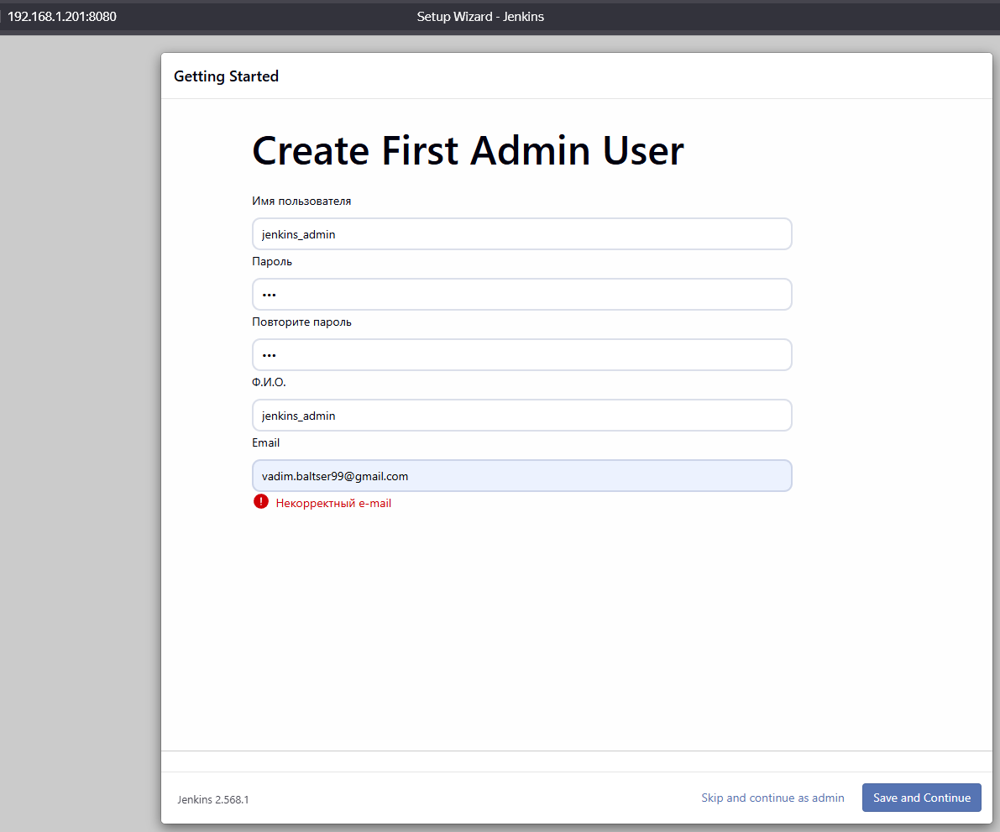
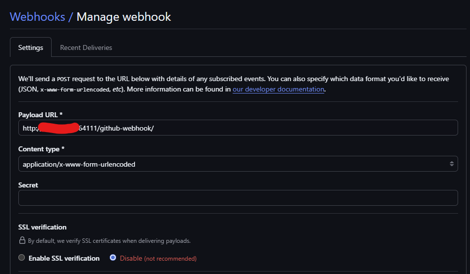
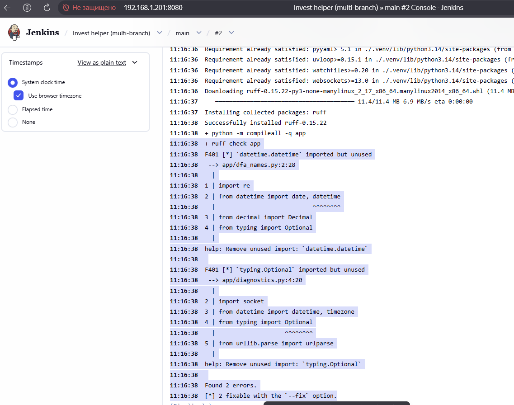
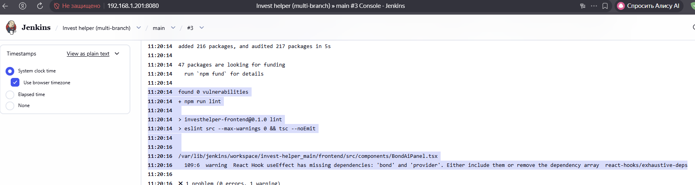
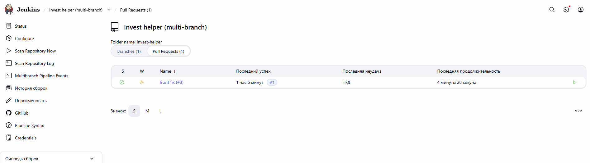

# Lesson 29. CI/CD — сравнение CI-систем

Провёл исследование популярных CI-систем: Jenkins, Travis CI, CircleCI, GitLab CI/CD и дополнительно GitHub Actions (часто выбирают на новых проектах). Ниже — особенности каждой системы и сравнение по заданным критериям.

## Обзор систем

### Jenkins

Классический self-hosted CI-сервер. Open source (MIT), конфигурация через UI или Pipeline as Code (`Jenkinsfile`, Declarative/Scripted Pipeline на Groovy).

**Возможности:**
- Более 1800 плагинов: SCM, облака, Docker/Kubernetes, уведомления, артефакты
- Распределённые сборки (master/controller + agents)
- Полный контроль над инфраструктурой (в т.ч. air-gapped / on-prem)

**Ограничения:**
- Высокая стоимость владения: установка, обновления, безопасность, плагины
- Качество плагинов неоднородное; обновления могут ломать пайплайны
- Крутая кривая обучения; Groovy-пайплайны сложнее YAML у SaaS-решений

### Travis CI

SaaS CI, исторически тесно связан с GitHub. Конфиг — `.travis.yml` в репозитории. Matrix builds для разных версий языков/ОС.

**Возможности:**
- Простая настройка для типичных стеков (Node, Python, Ruby, Go и др.)
- Docker, кэш, артефакты, статусы в PR
- Есть on-prem вариант (Travis CI Server)

**Ограничения:**
- После изменений модели (ограничение бесплатных сборок для OSS) популярность снизилась
- Меньше гибкости и экосистемы по сравнению с CircleCI / GitHub Actions / GitLab
- Для крупных команд часто уступают по масштабу и скорости конкурентам

### CircleCI

SaaS-платформа с упором на скорость сборок и параллелизм. Конфиг — `.circleci/config.yml`. Оплата по кредитам (credits).

**Возможности:**
- Orbs (готовые переиспользуемые пакеты шагов)
- Параллельный запуск тестов, ML test splitting
- Docker и remote Docker, кэширование, workflows
- Self-hosted runners при необходимости

**Ограничения:**
- Кредитная модель может быть непредсказуемой по стоимости
- Глубже всего заточен под GitHub; Bitbucket/GitLab — слабее экосистема
- Сложная оптимизация минут/кредитов на больших проектах

### GitLab CI/CD

CI/CD встроен в GitLab (SaaS и self-managed). Конфиг — `.gitlab-ci.yml`. Runners: shared (облако GitLab) или свои (shell, Docker, Kubernetes).

**Возможности:**
- Единая платформа: репозиторий, MR, CI/CD, Registry, Issues, security-сканеры
- Auto DevOps, environments, review apps, multi-project pipelines
- Хорошая интеграция с Kubernetes и контейнерами

**Ограничения:**
- На Free SaaS мало минут shared runners (порядка сотен в месяц)
- Полный набор фич — в Premium/Ultimate (дорого на больших командах)
- Вне GitLab (например, только GitHub) смысл слабее, чем у Actions/CircleCI

### GitHub Actions

Встроенный CI в GitHub. Workflows в `.github/workflows/*.yml`, Marketplace с тысячами Actions.

**Возможности:**
- Нулевая интеграция с PR, Issues, Packages, Environments
- Большой Marketplace, удобно для open source (публичные репо — щедрый лимит)
- Self-hosted runners + облачные runners GitHub

**Ограничения:**
- Привязка к экосистеме GitHub
- Минуты на private-репозиториях быстро заканчиваются у активных команд
- Сложная оркестрация enterprise-масштаба иногда уступает специализированным CI

---

## Сравнение по критериям

### 1. Интеграция с различными технологиями

| Система | Оценка | Комментарий |
|---------|--------|-------------|
| **Jenkins** | Отлично | Плагины почти под любой стек, язык, облако, SCM |
| **GitLab CI** | Отлично | Docker/K8s, любые образы runners; язык не важен |
| **GitHub Actions** | Отлично | Actions + контейнеры; широкий Marketplace |
| **CircleCI** | Хорошо | Сильный Docker/Linux; orbs для популярных стеков |
| **Travis CI** | Хорошо | Классические языки и matrix; экосистема уже |

### 2. Гибкость настройки

| Система | Оценка | Комментарий |
|---------|--------|-------------|
| **Jenkins** | Максимальная | Scripted Pipeline, произвольные агенты, плагины |
| **GitLab CI** | Высокая | Stages, rules, includes, parent-child, DAG-like needs |
| **CircleCI** | Высокая | Workflows, orbs, динамические конфиги |
| **GitHub Actions** | Высокая | Reusable workflows, matrix, composite actions |
| **Travis CI** | Средняя | Простой YAML; меньше «продвинутых» конструкций |

### 3. Масштабируемость

| Система | Оценка | Комментарий |
|---------|--------|-------------|
| **Jenkins** | Высокая* | Горизонтально через agents; *нужна своя инфраструктура и админы |
| **CircleCI** | Высокая | Параллелизм и concurrency «из коробки» (за кредиты) |
| **GitLab CI** | Высокая | Свои runners / K8s executor; SaaS — лимиты тарифа |
| **GitHub Actions** | Высокая | Много runners; лимиты минут и concurrency по плану |
| **Travis CI** | Средняя | Подходит средним нагрузкам; на очень больших объёмах слабее |

### 4. Интеграция с другими инструментами разработки

| Система | Оценка | Комментарий |
|---------|--------|-------------|
| **GitLab CI** | Отлично | «Всё в одном»: Git, MR, Registry, Deploy, Security |
| **GitHub Actions** | Отлично | Нативный GitHub + Packages, Environments, Apps |
| **Jenkins** | Отлично | Плагины: Jira, Slack, Sonar, Nexus, облака и т.д. |
| **CircleCI** | Хорошо | Slack, Jira, cloud deploy; через orbs и API |
| **Travis CI** | Хорошо | GitHub-first; деплой в популярные облака |

### 5. Поддержка сообщества

| Система | Оценка | Комментарий |
|---------|--------|-------------|
| **GitHub Actions** | Очень сильная | Документация, Marketplace, много примеров 2024–2026 |
| **Jenkins** | Сильная | Огромная база знаний; часть плагинов устаревает |
| **GitLab CI** | Сильная | Активная документация и сообщество GitLab |
| **CircleCI** | Хорошая | Orbs, блоги, поддержка вендора |
| **Travis CI** | Слабее | Бывший лидер OSS; сейчас меньше новых материалов |

### 6. Цена и лицензирование

| Система | Лицензия / модель | Практическая стоимость |
|---------|-------------------|------------------------|
| **Jenkins** | MIT, бесплатно | «Бесплатно» только ПО; платите за серверы + время DevOps |
| **GitLab CI** | Freemium / подписка | Free: мало минут; Premium/Ultimate — $/user/мес + минуты |
| **GitHub Actions** | Freemium | Публичные репо щедро; private — минуты / Team / Enterprise |
| **CircleCI** | Freemium, credits | Free tier с кредитами; Performance от ~$15/мес + кредиты |
| **Travis CI** | Коммерческий SaaS | Usage-based / Unlimited; отдельный Server для on-prem |

**Вывод по цене:** для маленькой команды на GitHub часто дешевле Actions; для GitLab-команды — встроенный CI; Jenkins выгоден при уже имеющейся инфраструктуре и жёстких требованиях к on-prem, иначе TCO часто выше SaaS.

### 7. Надёжность и производительность

| Система | Надёжность | Производительность |
|---------|------------|--------------------|
| **CircleCI** | Высокая (SaaS SLA) | Часто лучшая скорость за счёт параллелизма и кэша |
| **GitHub Actions** | Высокая | Хорошая; зависит от очередей shared runners |
| **GitLab CI** | Высокая | Shared runners — очередь/лимиты; свои runners — контроль |
| **Jenkins** | Зависит от вас | Может быть очень быстрым на своих мощных agents |
| **Travis CI** | Средняя/хорошая | Обычно достаточна; на пиках уступает лидерам |

SaaS даёт SLA и меньше «упавших агентов», но зависимость от вендора. Jenkins надёжен настолько, насколько настроены HA, бэкапы и мониторинг.

---

## Сводная таблица

| Критерий | Jenkins | Travis CI | CircleCI | GitLab CI/CD | GitHub Actions |
|----------|---------|-----------|----------|--------------|----------------|
| Технологии | ★★★★★ | ★★★☆☆ | ★★★★☆ | ★★★★★ | ★★★★★ |
| Гибкость | ★★★★★ | ★★★☆☆ | ★★★★☆ | ★★★★☆ | ★★★★☆ |
| Масштаб | ★★★★★ | ★★★☆☆ | ★★★★★ | ★★★★☆ | ★★★★☆ |
| Интеграции | ★★★★★ | ★★★☆☆ | ★★★★☆ | ★★★★★ | ★★★★★ |
| Сообщество | ★★★★☆ | ★★☆☆☆ | ★★★★☆ | ★★★★☆ | ★★★★★ |
| Цена (TCO) | ★★★☆☆ | ★★★☆☆ | ★★★☆☆ | ★★★☆☆ | ★★★★☆ |
| Надёжность/скорость | ★★★★☆ | ★★★☆☆ | ★★★★★ | ★★★★☆ | ★★★★☆ |

---

## Выводы: когда что выбирать

1. **Jenkins** — полный контроль, legacy, air-gap, нестандартные интеграции; нужна команда на поддержку.
2. **GitLab CI/CD** — уже используете GitLab как основную платформу разработки.
3. **GitHub Actions** — репозитории на GitHub, быстрый старт, OSS и типичные веб/бэкенд проекты.
4. **CircleCI** — важны скорость сборок, параллельные тесты и отлаженный SaaS-CI без привязки к «монолиту» GitLab.
5. **Travis CI** — поддержка старых проектов; для новых чаще берут Actions / GitLab / CircleCI.

## Установка Jenkins

### Установил Java

```bash
sudo apt update
sudo apt install -y fontconfig openjdk-21-jre
java -version
```

```bash
vadim@TMS-UBUNTU-VM1:~$ java -version
openjdk version "21.0.11" 2026-04-21
OpenJDK Runtime Environment (build 21.0.11+10-1-26.04.2-Ubuntu)
OpenJDK 64-Bit Server VM (build 21.0.11+10-1-26.04.2-Ubuntu, mixed mode, sharing)
```

### Установка и первичная настройка Jenkins

```bash
sudo mkdir -p /etc/apt/keyrings
sudo wget -O /etc/apt/keyrings/jenkins-keyring.asc \
  https://pkg.jenkins.io/debian-stable/jenkins.io-2026.key
echo "deb [signed-by=/etc/apt/keyrings/jenkins-keyring.asc] \
  https://pkg.jenkins.io/debian-stable binary/" \
  | sudo tee /etc/apt/sources.list.d/jenkins.list > /dev/null

sudo apt update
sudo apt install -y jenkins
```

Сервис запустился на 8080 порту. Ввел initialAdminPassword и создал пользователя:



## Настройка Pipeline

У меня есть пет-проект InvestHelper (Анализатор брокерского портфеля, работающий с api Т-Инвестиций). Стек проекта backend - python, frontend - react. Буду настраивать сборку проекта в Jenkins. Репозиторий находится на GitHub

### Проект Jenkins

Создал проект типа Multi-branch.

Настройки:

- Repository HTTPS URL - `https://github.com/VBaltser/InvestHelper.git`
- Behaviours - стандартные настройки, по которым сборка будет производиться при создании PR
- Mode - `by Jenkinsfile`

### Доработка проекта InvestHelper

Сейчас в проекте нет тестов. Добавил самые базовые `ruff check app` для бэкенда и `npm run lint` для фронта. 

В проекте создал Jenkinsfile

```Jenkinsfile
pipeline {
  agent any

  options {
    timestamps()
    disableConcurrentBuilds()
  }

  stages {
    stage('Backend') {
      steps {
        dir('backend') {
          sh '''
            set -e
            python3 -m venv .venv
            . .venv/bin/activate
            pip install -r requirements.txt -r requirements-dev.txt
            python -m compileall -q app
            ruff check app
          '''
        }
      }
    }

    stage('Frontend') {
      steps {
        dir('frontend') {
          sh '''
            set -e
            npm ci
            npm run lint
            npm run build
          '''
        }
      }
    }
  }

  post {
    always {
      archiveArtifacts artifacts: 'frontend/dist/**', allowEmptyArchive: true
    }
  }
}
```

В нем описаны 2 stage: 

Backend - установка зависимостей, компиляция и тест `ruff check app`
Frontend - установка зависимостей, тест `npm run lint` и билд проекта `npm run build`

После основных этапов происходит сохранение артефактов - результатов билда фронта.

### Настройка Webhook

Для автоматической сборки проекта в Jenkins на определнные события нужно настроить webhooks в GitHub

Настройка webhook. Указал свой IP:



На роутере сделал "проброс" до VM, где развернут Jenkins:


### Настройка VM

Для запуска сборок, было необходимо установить пакеты. `python-env` и `nodejs`

### Тестирование Jenkins

Запушил изменения с добавлением тестов, но без исправления ошибок. Первый раз запускал сборку вручную. Результат: ошибки на лишние импорты, которые нашел `ruff check app`



Затем я запушил исправления на бэке, после этого снова запустил сборку вручную. Результат: ошибки линта на фронте.



После этого я подключил Webhooks и создал PR с исправлением ошибки линта. Автоматически запустилась сборка по ветке, с которой был создан PR, которая успешно прошла



После принятия PR, запустилась сборка main ветки, которая тоже прошла успешно:


